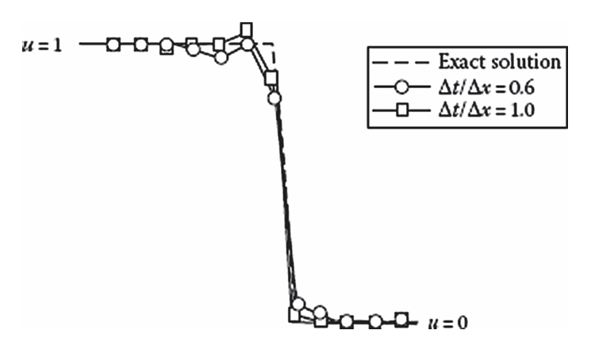
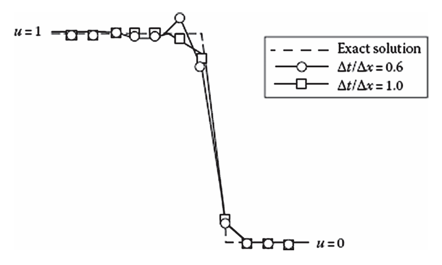
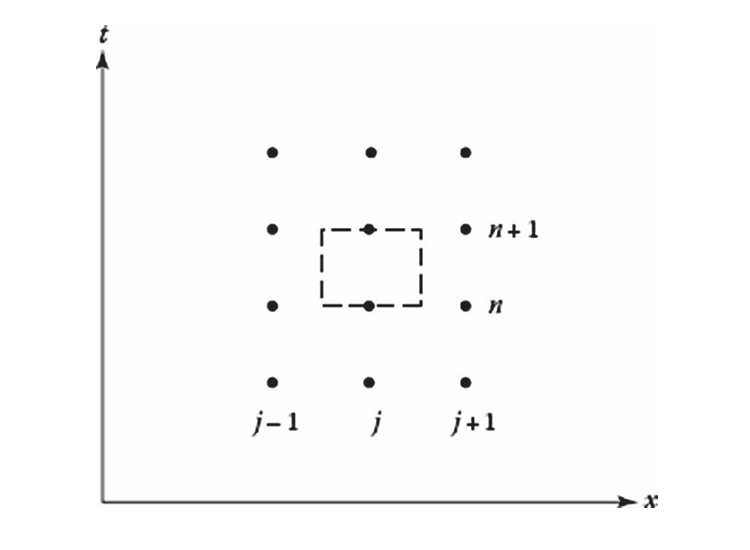
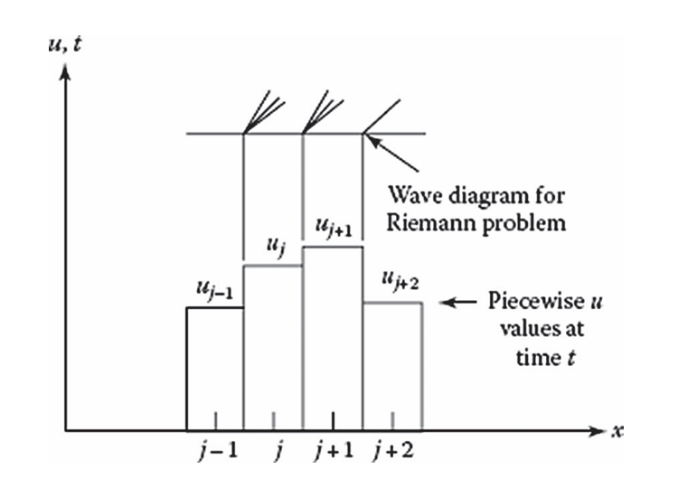
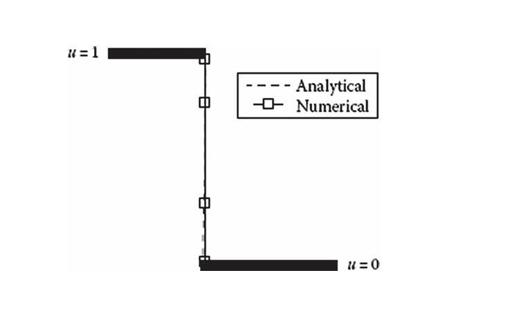

# Inviscid Burgers' Equation

The Burgers’ equation serves as an analog to the Navier Stokes equations. The equation includes an unsteady term, a nonlinear convection term, and a viscous term.

$$
\frac {\partial u}{\partial t}+u\frac {\partial u}{\partial x}=\mu\frac {\partial^2u}{\partial x^2}
$$ {#eq-burgers}

When the viscous term is included, Eqn. (@eq-burgers) is parabolic. The inviscid Burgers' equation arises when viscous effects are zero, $\mu=0$.

$$
\frac {\partial u}{\partial t}+u\frac {\partial u}{\partial x}=0
$$ {#eq-inviscid-burgers}

Whereas the linear 1D convection equation models the simple case of a wave propagating at a constant speed, Eqn. (@eq-inviscid-burgers) may be viewed as a nonlinear wave equation that can model waves propagating at varying speeds. Since Burgers' equation can correctly model varying wave speeds, it can be used to model shocks as waves of differing speeds coalesce. This wave equation is similarly hyperbolic.

Nonlinear hyperbolic PDEs exhibit two types of solutions according to Lax (1954). Consider the general case of the equation below. The Jacobian $A=\frac {\partial F_i}{\partial u_j}$ is introduced from the chain rule. If $u$ and $F$ are both vectors, $A$ is a matrix.

$$
\frac {\partial u}{\partial t}+\frac {\partial F}{\partial x}=\frac {\partial u}{\partial t}+A\frac {\partial u}{\partial x}=0
$$ {#eq-general-hyperbolic-pde}

## Lax Method

First order methods are rarely used in solving hyperbolic equations owing to their dissipative nature. The Lax method is typically used to demonstrate its dissipative nature and the application of a first order method to a nonlinear equation.

$$
u_j^{n+1}=\frac {u_{j-1}^n+u_{j+1}^n}2-\frac {\Delta t}{\Delta x}\frac {F_{j+1}^n-F_{j-1}^n}2
$$ {#eq-lax-method-inviscid-burgers}

The first term is $u_j^n$ averaged between its neighboring cells. This introduces artificial viscosity into the method that smooths out any instabilities or oscillations in the solution.

::: {.callout-note title="Derivation of the Lax Method" collapse="true"}
Expand $u_j^{n+1}$ about $u_j^n$ using a Taylor series and substitute the time derivative term with the spatial derivative. From Eqn. (@eq-general-hyperbolic-pde), we have that $u_t=-F_x$. Therefore

$$
\begin{aligned}
u(x,t+\Delta t) & =u(x,t)+\left.\frac {\partial u}{\partial t}\right|_{x,t}\Delta t+\left.\frac {\partial^2u}{\partial t^2}\right|_{x,t}\frac {\Delta t^2}{2!}+\cdots \\
 & =u(x, t)-\left.\frac {\partial F}{\partial x}\right|_{x,t}\Delta t+\mathcal O(\Delta t^2)
\end{aligned}
$$

Neglecting the higher order terms and applying a central difference scheme on $F_x$, the Lax method is obtained. An average is used for calculating the $u_j^n$ term to introduce numerical dissipation.

$$u_j^{n+1}=u_j^n-\frac {\Delta t}{\Delta x}\frac {F_{j+1}^n-F_{j-1}^n}2$$
:::

The amplification factor for this scheme is given below

$$
G=\cos\beta-i\frac {\Delta t}{\Delta x}A\sin\beta
$$ {#eq-lax-method-inviscid-burgers-amplification-factor}

where the dimensionless wave number $\beta$ is $k\Delta x$. For Burgers' equation, $F=u^2/2$, so the Jacobian is simply $A(u)=u$. Stability occurs when $|G|\leq1$. For the $G$ above, Eqn. (@eq-lax-method-inviscid-burgers-amplification-factor) reduces down to

$$
\left|\frac {\Delta t}{\Delta x}u_{\mathrm{max}}\right|\leq1
$$

where $u_{\mathrm{max}}$ is the maximum eigenvalue of the Jacobian $A$.

## Lax-Wendroff Method

The Lax-Wendroff method was one of the first second order finite difference methods derived for hyperbolic PDEs. Once again, consider the general form of the governing Eqn. (@eq-general-hyperbolic-pde). The Lax-Wendroff method is

$$
u_j^{n+1}=u_j^n-\frac {\Delta t}{\Delta x}\frac {F_{j+1}^n-F_{j-1}^n}2+\frac 12\left(\frac {\Delta t}{\Delta x}\right)^2\left[A_{j+\frac 12}^n\left(F_{j+1}^n-F_j^n\right)-A_{j-\frac 12}^n\left(F_j^n-F_{j-1}^n\right)\right]
$$ {#eq-lax-wendroff-method-inviscid-burgers}

There are many different ways of evaluating the Jacobian matrix at the half interval $j\pm\frac 12$. The simplest is to use the average of the neighboring cell values. With Burgers' equation, $A(u)=u$ and the half interval Jacobians can be evaluated as

$$
A_{j\pm\frac 12}=A\left(\frac {u_j+u_{j\pm1}}2\right)=\frac {u_j+u_{j\pm1}}2
$$

::: {.callout-note title="Derivation of the Lax-Wendroff Method" collapse="true"}
Start off in the same manner as the Lax method and expand $u_j^{n+1}$ about $u_j^n$ using a Taylor series.

$$
u(x,t+\Delta t)=u(x,t)+\left.\frac {\partial u}{\partial t}\right|_{x,t}\Delta t+\left.\frac {\partial^2u}{\partial t^2}\right|_{x,t}\frac {\Delta t^2}{2!}+\left.\frac {\partial^3u}{\partial t^3}\right|_{x,t}\frac {\Delta t^3}{3!}+\cdots
$$

Next, replace the time derivatives with spatial derivatives. From Eqn. (@eq-general-hyperbolic-pde), the first time derivative is

$$
\frac {\partial u}{\partial t}=-\frac {\partial F}{\partial x}
$$

For the second derivative term, differentiate the equation above with respect to time and interchange the differentiation order.

$$
\frac {\partial^2u}{\partial t^2}=-\frac {\partial}{\partial x}\frac {\partial F}{\partial t}=-\frac {\partial}{\partial x}\frac {\partial F}{\partial u}\frac {\partial u}{\partial t}=\frac {\partial}{\partial x}\left(A\frac {\partial F}{\partial x}\right)
$$

The last step is due to the chain rule. Substitute into the Taylor series to obtain

$$
u(x,t+\Delta t)=u(x,t)-\left.\frac {\partial F}{\partial x}\right|_{x,t}\Delta t+\left.\frac {\partial}{\partial x}\left(A\frac {\partial F}{\partial x}\right)\right|_{x,t}\frac {\Delta t^2}2+\mathcal O(\Delta t^3)
$$

Apply central differencing schemes to all derivative terms. The second order derivative is

$$
\begin{aligned}
\frac {\partial}{\partial x}\left(A\frac {\partial F}{\partial x}\right) & \approx\frac 1{\Delta x}\left[A_{j+\frac 12}\left.\frac {\partial F}{\partial x}\right|_{j+\frac 12}-A_{j-\frac 12}\left.\frac {\partial F}{\partial x}\right|_{j-\frac 12}\right] \\ & =\frac 1{\Delta x}\left[A_{j+\frac 12}\frac {F_{j+1}-F_j}{\Delta x}-A_{j-\frac 12}\frac {F_j-F_{j-1}}{\Delta x}\right] \\ & =\frac 1{\Delta x^2}\left[A_{j+\frac 12}\left(F_{j+1}-F_j\right)-A_{j-\frac 12}\left(F_j-F_{j-1}\right)\right]
\end{aligned}
$$

The $F_x$ terms, when evaluated at the cell interface, actually utilize a central difference as $F_j$ and $F_{j\pm1}$ are both exactly $\frac {\Delta x}2$ away from the boundary. Therefore, central differences are used to decompose all derivative terms into their stencil approximations and the second order accuracy is maintained. Putting everything together gives the Lax-Wendroff method.
:::

The amplification factor is

$$
G=1-2\left(\frac {\Delta t}{\Delta x}A\right)^2(1-\cos\beta)-2i\frac {\Delta t}{\Delta x}A\sin\beta
$$ {#eq-lax-wendroff-method-inviscid-burgers-amplification-factor}

When $|G|\leq1$, the scheme is stable. For the amplification above, this simplifies down to

$$
\left|\frac {\Delta t}{\Delta x}u_{\mathrm{max}}\right|\leq1
$$ {#eq-lax-wendroff-method-inviscid-burgers-stability}

When Lax-Wendroff is applied to the example problem, the method correctly predicts the position of the discontinuity. Moreover, the solution is relatively sharp and well-defined, with some oscillations occurring at either ends of the discontinuity. In comparison, the Lax method was purely monotone and did not exhibit any oscillatory motion due to the method's lower order accuracy. When the Courant number is decreased, the number of oscillations in the Lax-Wendroff solution increases as the solution quality is degraded.

The numerical flux is

$$
f_{j+\frac 12}=\frac {F_{j+1}+F_j}2-\frac 12\frac {\Delta t}{\Delta x}\lambda_{j+\frac 12}^2\left(u_{j+1}-u_j\right)
$$ {#eq-lax-wendroff-method-inviscid-burgers-numerical-flux}

where $\lambda_{j+\frac 12}$ is the eigenvalue of the Jacobian $A_{j+\frac 12}$. For Burgers' equation, this is simply $u_{j+\frac 12}$. When compared to that of the Lax method, the difference is the correction term below.

$$
f_{j+\frac 12}^{\mathrm{LW}}-f_{j+\frac 12}^{\mathrm L}=\frac {\Delta x}{\Delta t}\frac {u_{j+1}-u_j}2\left[1-\left(\lambda_{j+\frac 12}\frac {\Delta t}{\Delta x}\right)^2\right]
$$

This correction term can be added to $f_{j+\frac 12}^{\mathrm L}$ to provide second order accuracy and modify the solution to the form of Lax-Wendroff. However, due to the higher order, oscillations may occur near discontinuities. To avoid this, it is desired to suppress this correction term near discontinuities. This is done through the use of **limiters**.

$$
f_{j+\frac 12}^{\mathrm L}=\frac 12\left[F_j+F_{j-1}-\frac {\Delta x}{\Delta t}\left(u_{j+1}-u_j\right)\right]+\phi\frac {\Delta x}{\Delta t}\frac {u_{j+1}-u_j}2\left[1-\left(\lambda_{j+\frac 12}\frac {\Delta t}{\Delta x}\right)^2\right]
$$

The function $\phi$ limits the presence of the correction term near discontinuities to reduce the Lax method's overall order and achieve a monotone, or near-monotone, behavior locally. More information is given about limiters in Section 4.4.12.

## MacCormack Method

This is the two-step predictor-corrector version of Lax-Wendroff. The Jacobian becomes more computationally difficult and expensive for nonlinear equations with Lax-Wendroff. MacCormack avoids evaluating the Jacobian entirely and is therefore, more easily implemented for highly nonlinear problems.

$$
\begin{aligned}
u_j^{\overline{n+1}} & =u_j-\frac {\Delta t}{\Delta x}\left(F_{j+1}^n-F_j^n\right) \\
u_j^{n+1} & =\frac 12\left[u_j^n+u_j^{\overline{n+1}}-\frac {\Delta t}{\Delta x}\left(F_j^{\overline{n+1}}-F_{j-1}^{\overline{n+1}}\right)\right]
\end{aligned}
$$ {#eq-maccormack-method-inviscid-burgers}

The amplification factor, Eqn. (@eq-lax-wendroff-method-inviscid-burgers-amplification-factor), and stability requirement, Eqn. (@eq-lax-wendroff-method-inviscid-burgers-stability), are the same as that of Lax-Wendroff. When compared to Lax-Wendroff for the example problem, the two solutions differ. This is due to the switched differencing in the predictor and corrector steps, as well as the nonlinear nature of the PDE. In general, MacCormack provides better resolution at discontinuities. For the best resolution, the difference in the predictor, $F_{j+1}-F_j$, should be in the same direction as the propagation direction of the discontinuity. If the wave is propagating to the left, then the difference should be $F_{j-1}-F_j$ instead.

::: {#fig-lax-wendroff-maccormack-solution-comparison-inviscid-burgers layout-ncol=2}

{.lightbox}

{.lightbox}

Comparison of Lax-Wendroff and MacCormack solutions to the inviscid Burgers' equation
:::

## Godunov Scheme

The previous schemes used a Taylor series expansion to approximate spatial and temporal derivatives. This method works well when the series' convergence criteria are met and the function converges everywhere, meaning the function is continuous and differentiable up until the order of the difference scheme. For shocks and other discontinuities, though, this is not necessarily the case. Godunov (1959) found a way to avoid this differentiability requirement using a finite volume approach to evaluate the fluxes at the cell interface and approximate the conservation equations.

Consider the control volume shown below. The $x$ and $y$ axes are space and time respectively. The control volume extends from $x_{j-\frac 12}$ to $x_{j+\frac 12}$ in space and from $t^n$ to $t^{n+1}$ in time. The center of the control volume is at $\left(x_j, t^{n+\frac 12}\right)$.

{width=400 .lightbox}

Integrating Eqn. (@eq-general-hyperbolic-pde) across the control volume, then the volume-averaged $u$ and time-averaged flux $f$ are

$$
\begin{aligned}
\overline u_j^{n+1}=\overline u_j^n-\frac {\Delta t}{\Delta x}\left[f\left(u_{j+\frac 12}\right)-f\left(u_{j-\frac 12}\right)\right]
\end{aligned}
$$ {#eq-godunov-scheme-inviscid-burgers-conservation-equation}

::: {.callout-note title="Derivation of the averaged approximatione quation" collapse=true}

Integrating Eqn. (@eq-general-hyperbolic-pde) and swapping the integration order, then

$$
\int\limits_t^{t+\Delta t}\int\limits_{x-\Delta x/2}^{x+\Delta x/2}\frac {\partial u}{\partial t}+\frac {\partial F}{\partial x}=\int\limits_{x-\Delta x/2}^{x+\Delta x/2}u(x,t+\Delta t)-u(x,t)\,\mathrm dx+\int\limits_t^{t+\Delta t}F\left(x+\frac {\Delta x}2,t\right)-F\left(x-\frac {\Delta x}2,t\right)\,\mathrm dt=0
$$

Using the time and volume averages below for $F$ and $u$ respectively

$$
\begin{aligned}
\overline u_j^n & =\frac 1{\Delta x}\int\limits_{x-\Delta x/2}^{x+\Delta x/2}u(x,t)\,\mathrm dx \\
f_j^n & =\frac 1{\Delta t}\int\limits_t^{t+\Delta t}f(x,t)\,\mathrm dt
\end{aligned}
$$

Then the discretized equation simplifies down to

$$
\Delta x\left(\overline u_j^{n+1}-\overline u_j^n\right)+\Delta t\left(f_{j+\frac 12}^n-f_{j-\frac 12}^n\right)=0
$$

Solving for $\overline u_j^{n+1}$ completes the proof for Eqn. (@eq-godunov-scheme-inviscid-burgers-conservation-equation).

:::

The Godunov scheme solves the Riemann problem that arises when the spatial domain is discretized and the flow field is propagated through time to determine its behavior at the next time step. Recall that this is done by calculating the flux through each cell interface needed to advance the solution. For Burgers' equation, the Riemann problem is governed by the PDE below.

$$
\begin{aligned}
\frac {\partial u}{\partial t}+\frac {\partial}{\partial x}\left(\frac {u^2}2\right)=0
\end{aligned}
$$ {#eq-godunov-scheme-inviscid-burgers-riemann-problem}

If the local coordinate system is centered at the cell interface, then the initial condition for the local Riemann problem about the cell boundary is given by the step function below.

$$
u(x,0)=\begin{cases}
u_j & \qquad x\leq0 \\
u_{j+1} & \qquad x>0
\end{cases}
$$

Graphically, considering the $j+\frac 12$ cell boundary, the velocity has a value of $u_j$ to the "left" of the interface ($x<0$) and a value of $u_{j+1}$ to the "right". Similarly, taking the $j-\frac 12$ boundary, the fluid velocity has a value of $u_{j-1}$ to the left of the interface and $u_j$ to the right. The sharp discontinuity at the interface leads to a flux that dictates how the flow field will propagate through time. A shock wave will form if $u_j>u_{j+1}$ as this corresponds to faster-moving waves "catching up" to the slower-moving waves in front and coalescing. On the other hand, if $u_j<u_{j+1}$, an expansion (rarefaction) wave will form. How each of these waves will propagate in time is determined when solving the Riemann problem.

{width=400 .lightbox}

If $c_{j+\frac 12}$ is defined as

$$
c_{j+\frac 12}=\left.\frac {\mathrm dx}{\mathrm dt}\right|_{j+\frac 12}=\frac {u_j+u_{j+1}}2
$$

then the solution to the Riemann problem for Eqn. (@eq-general-hyperbolic-pde) is: for shocks ($u_j>u_{j+1}$)

$$
\begin{aligned}
u & =\left\{\begin{array}{ll}
u_j \qquad\qquad & \dfrac xt\leq c_{j+\frac 12} \\ \\
u_{j+1} \qquad\qquad & \dfrac xt>c_{j+\frac 12}
\end{array}\right. \\ \\
f_{j+\frac 12} & =\left\{\begin{array}{ll}
\dfrac 12u_j^2 \qquad\quad & c_{j+\frac 12}>0 \\ \\
\dfrac 12u_{j+1}^2 \qquad\quad & c_{j+\frac 12}<0
\end{array}\right.
\end{aligned}
$$ {#eq-godunov-scheme-inviscid-burgers-shock-solution}

and for expansion waves ($u_j<u_{j+1}$)

$$
\begin{aligned}
u & =\left\{\begin{array}{ll}
u_j \qquad\qquad & \dfrac xt<u_j \\ \\
\dfrac xt \qquad\qquad & u_j<\dfrac xt<u_{j+1} \\ \\
u_{j+1} \qquad\qquad & \dfrac xt>u_{j+1}
\end{array}\right. \\ \\
f_{j+\frac 12} & =\left\{\begin{array}{lll}
0 \qquad\quad & u_j<0<u_{j+1} & \\ \\
\dfrac 12u_j^2 \qquad\quad & c_{j+\frac 12}>0 \qquad\qquad & 0<u_j<u_{j+1} \\ \\
\dfrac 12u_{j+1}^2 \qquad\quad & c_{j+\frac 12}<0 \qquad\qquad & u_j<u_{j+1}<0
\end{array}\right.
\end{aligned}
$$ {#eq-godunov-scheme-inviscid-burgers-expansion-solution}

Equations (@eq-godunov-scheme-inviscid-burgers-shock-solution) and (@eq-godunov-scheme-inviscid-burgers-expansion-solution) assume that waves from adjacent cells do not interact with one another (i.e., shocks propagating from the left do not interfere with shocks on their right).

::: {.callout-important title="Proof of self-similarity for the Riemann problem"}

An important concept here is the idea of self-similarity of the Riemann problem for the inviscid Burgers' equation. This can be proven by showing invariance under a uniform scaling of time and space by a factor of $a$ where $a>0$. Define transformed time and space coordinates as $t'=at$ and $x'=ax$. Note that the prime notation will refer to the transformed coordinates rather than differentiation. By the chain rule, then

$$
\begin{aligned}
\frac {\partial u}{\partial t} & =\frac {\partial u}{\partial t'}\frac {\partial t'}{\partial t}=a\frac {\partial u}{\partial t'} \\
\frac {\partial u}{\partial x} & =\frac {\partial u}{\partial x'}\frac {\partial x'}{\partial x}=a\frac {\partial u}{\partial x'}
\end{aligned}
$$

Eqn. (@eq-inviscid-burgers) becomes, after normalizing by $a$,

$$
\frac {\partial u}{\partial t'}+u\frac {\partial u}{\partial x'}=0
$$

Therefore, Eqn. (@eq-inviscid-burgers) has no inherent time or length scale. If $u(x,t)$ is a solution to Eqn. (@eq-inviscid-burgers), then $u(ax,at)$ must also be a solution to the PDE in the scaled coordinate system. Invariance can also be shown for the initial condition by inspecting $u(ax,0)$. Taking $u(ax,0)$ at the $j+\frac 12$ cell boundary, then

$$
u(ax,0)=\begin{cases}
u_j \qquad\qquad & ax<0 \\
u_{j+1} \qquad\qquad & ax>0
\end{cases}
$$

Since $a>0$, the $ax<0$ and $ax>0$ conditions are identical to $x<0$ and $x>0$. Therefore, $u(ax,0)=u(x,0)$ and the initial condition is also invariant to the scaling parameter $a$. Since the PDE and initial condition are unchanged by scaling, then $u(ax,at)=u(x,t)$ for all $a>0$. Since $a$ may be any value, choose $a=\frac 1t$ to reveal that $u(ax,at)=u(\xi,1)$ where $\xi=\frac xt$ is the self-similarity parameter. In other words, the ratio between space and time is the critical parameter in the governing equation, not necessarily the exact point in time and space.

:::

::: {.callout-note title="Derivation of the Godunov Scheme wave solutions to the Riemann problem" collapse=true}

This is a work in progress!

:::

The stability requirement of this is that the wave can only travel at most half of one cell distance. Therefore, stability is achieved if

$$
\left|\frac {\Delta t}{\Delta x}u_{\mathrm{max}}\right|\leq\frac 12
$$

Using Equations (@eq-godunov-scheme-inviscid-burgers-shock-solution) and (@eq-godunov-scheme-inviscid-burgers-expansion-solution) in Eqn. (@eq-godunov-scheme-inviscid-burgers-conservation-equation) to obtain a solution. As shown below, the solution is superior for shock propagation than the methods discussed before and manages to capture the sharp discontinuity very well. This method is also capable of capturing expansion waves with comparable fidelity.

{width=400 .lightbox}

## Roe Scheme

When Godunov's method is applied to the equations that govern fluid flow, the solution must be determined iteratively. This iteration is computationally inefficient and time consuming, particularly for very complex flow fields. A potential solution is to solve an approximate Riemann problem rather than the exact nonlinear one. Roe (1980, 1981) proposed solving the linear problem below instead to approximate the nonlinear case.

$$
\frac {\partial u}{\partial t}+\overline u\frac {\partial u}{\partial x}=0
$$ {#eq-roe-scheme-inviscid-burgers-linear-riemann-problem}

The variable $\overline u$ is constant near the cell interface and is based on local conditions across the cell face where the desired flux to be computed is. The coefficient $\overline u$ must be constructed such that it satisfies the following conditions:

1. For any $u_j$ and $u_{j+1}$

$$
F_{j+1}-F_j=\overline u\left(u_{j+1}-u_j\right)
$$

2. When $u_j=u_{j+1}\equiv u$, then

$$
\overline u\left(u_j, u_{j+1}\right)=\overline u(u, u)=\frac {\partial F}{\partial u}=u
$$

These conditions apply only **across** cell interfaces. The first condition ensures the correct jump is recovered when a discontinuity occurs, and the second condition ensures that when $u$ is smooth, the nonlinear wave speed reduces to its correct value.