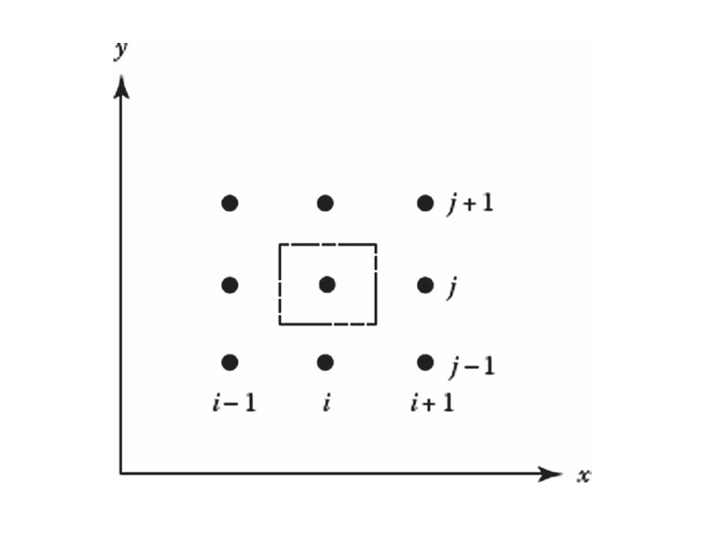

# Flux Splitting Schemes

In flux-vector splitting (FVS), the flux contributions into the cell are split into positive and negative components based on the eigenstructure of the system. The discretized form of the Euler equation in 2D is

$$
\frac {\partial\textbf U}{\partial t}\Delta V+\sum\limits_{\text{cell faces}}(\textbf E\Delta y-\textbf F\Delta x)=0
$$

where $\Delta V$ is the cell volume and $\Delta x$ and $\Delta y$ are the arc lengths of the cells in the 2D case. Using a forward difference in time, then the discretized equation becomes

$$
\left(\textbf U_{i,j}^{n+1}-\textbf U_{i,j}^n\right)\frac {\Delta V}{\Delta t}+\left(\textbf E\Delta y\right)\,\biggr|_{i-\frac 12,j}^{i+\frac 12,j}+\left(\textbf F\Delta x\right)\,\biggr|_{i,j-\frac 12}^{i,j+\frac 12}=0
$$ {#eq-discretized-euler-equation}

Solving for $\textbf U_{i,j}^{n+1}$ gives the conservative vector $\textbf U$ at the next time step. The crux of the problem now is solving for $\textbf E$ and $\textbf F$ at the cell boundaries.

::: {.callout-note title="Derivation of Discretized Euler Equation" collapse=true}

Consider the 2D control volume below centered on $(i, j)$. The cell boundaries are displayed from the cell centroid by $\frac 12$ in all directions.

{#fig-euler-equation-control-volume width=500 .lightbox}

Recall that the conservative vector $\textbf U$ and face fluxes $\textbf E$ and $\textbf F$ are defined as

$$
\textbf U=\begin{bmatrix}
\rho \\
\rho u \\
\rho v \\
\rho e_t
\end{bmatrix} \qquad\qquad\textbf E=\begin{bmatrix}
\rho u \\
\rho u^2+p \\
\rho uv \\
\rho h_tu
\end{bmatrix} \qquad\qquad\textbf F=\begin{bmatrix}
\rho v \\
\rho uv \\
\rho v^2+p \\
\rho h_tv
\end{bmatrix}
$$

Integrate Eqn. (@eq-discretized-euler-equation) over the control volume and applying Green's theorem to the flux terms gives

$$
\iint\limits_{\mathcal V}\frac {\partial\textbf U}{\partial t}\,\mathrm dV+\iint\limits_{\mathcal V}\frac {\partial\textbf E}{\partial x}-\frac {\partial\textbf F}{\partial y}\,\mathrm dV=\iint\limits_{\mathcal V}\frac {\partial\textbf U}{\partial t}\,\mathrm dV+\oint\limits_{\mathcal S}\left(\textbf E\,\mathrm dy-\textbf F\,\mathrm dx\right)=0
$$

The subscript $\mathcal S$ denotes the boundary. In discrete form, the contour integral transforms into a sum about each boundary of the cell, completing the proof. A natural question is to wonder how Eqn. (@eq-discretized-euler-equation) looks when extended to 3D in the general case. If curvilinear coordinates are used, where $\xi$, $\eta$, $\zeta$ map to the $x$, $y$, and $z$ axes respectively, and a volumetric source term, $\textbf H$ is included for generation effects, then Eqn. (@eq-discretized-euler-equation) becomes

$$
\frac {\mathrm d\left(\textbf U\Delta V\right)}{\mathrm dt}+\left(\textbf E_{\xi}-\textbf E_{v_{\xi}}\right)S_{\xi}\,\biggr|_{i+\frac 12,j,k}^{i-\frac 12,j,k}+\left(\textbf F_{\eta}-\textbf F_{v_{\eta}}\right)\,\biggr|_{i,j-\frac 12,k}^{i,j+\frac 12,k}+\left(\textbf G_{\zeta}-\textbf G_{v_{\zeta}}\right)_{i,j,k-\frac 12}^{i,j,k+\frac 12}=\textbf H\Delta V
$$

:::

## Stegar-Warming Splitting

Stegar and Warming (1979) developed an implicit algorithm to split $\textbf E$ and $\textbf F$ into a positive and negative contribution. To show this, consider the 1D Euler equation for simplicity. This procedure can be extended to 2D and 3D by adding more terms to the equation below.

$$
\frac {\partial\textbf U}{\partial t}+\frac {\partial\textbf E}{\partial x}=\frac {\partial\textbf U}{\partial t}+[A]\frac {\partial\textbf U}{\partial x}=0
$$ {#eq-stegar-warming-euler-equation}

where $[A]=\frac {\partial\textbf E}{\partial\textbf U}$ is a Jacobian, derived from the chain rule. If the system is hyperbolic, like with the Euler equations, then there exists at least an eigenvalue, $\lambda_i$, and eigenvector, $\textbf v_i$ pair such that $[A]\lambda_i=\lambda_i\textbf v_i$. Rewriting in matrix form and solving for $[A]$, then

$$
[A]=[T][\Lambda][T]^{-1}
$$ {#eq-hyperbolic-eigenvalue-equation}

where $[\Lambda]$ is a diagonal matrix of $\lambda_i$ and $[T]$ is a matrix whose columns are $\textbf v_i$ (called the right eigenvectors of $[A]$) in the order of $\lambda_i$. The inverse $[T]^{-1}$ is a matrix whose rows are $\textbf v_i$ (called the left eigenvectors of $[A]$). According to Stegar and Warming, if the equation state follows the form $p=\rho f(e)$, where $e$ is the internal energy, then the flux $\textbf E(\textbf U)$ is homogeneous of degree one in $\textbf U$. In other words, for any $\alpha$,

$$
\textbf E(\alpha\textbf U)=\alpha\textbf E(\textbf U)
$$

Using Eqn. (@eq-hyperbolic-eigenvalue-equation), the flux vector $\textbf E$ (and $\textbf F$ if it exists) can be rewritten as

$$
\textbf E=[A]\textbf U=[T][\Lambda][T]^{-1}\textbf U
$$

Both the flux vector and eigenvalue matrix can be written as having positive and negative contributions. Rewritting $[\Lambda]=[\Lambda^+]+[\Lambda^-]$ allows $[A]$ to also be written as having positive and negative contributions.

$$
[A]=[T][\Lambda^+][T]^{-1}+[T][\Lambda^-][T]^{-1}=[A^+]+[A^-]
$$

This results in the overall flux vector, $\textbf E$, as

$$
\textbf E=\textbf E^++\textbf E^-=[A^+]\textbf U+[A^-]\textbf U
$$

Substitute the positive and negative flux contributions, $\textbf E^+$ and $\textbf E^-$, into Eqn. (@eq-discretized-euler-equation) to get

$$
\frac {\partial\textbf U}{\partial t}+\frac {\partial\textbf E^+}{\partial x}+\frac {\partial\textbf E^-}{\partial x}=0
$$

The signs indicate the direction of wave propagation of the flux components. For instance, the components of vector $\textbf E^+$ are associated with wave propagation in the positive direction. It is important to note that the eigenvalues of $[A^{\pm}]=\frac {\partial\textbf E^{\pm}}{\partial x}$ are not the same as $\lambda^{\pm}$, as the exact $[A]$ matrix each $\lambda$ is assigned to is determined purely based off its sign. For 1D, the eigenvalues of $[A]$ are

$$
\begin{aligned}
\lambda_1 & =u \\
\lambda_2 & =u+a \\
\lambda_3 & =u-a
\end{aligned}
$$ {#eq-1d-euler-equation-eigenvalues}

## Van-Leer Splitting