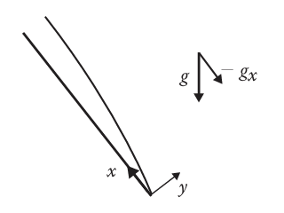

# Flat Plate Boundary Layers in Natural Convection

In naturally convecting flows, bulk fluid movement is driven by body forces, such a gravity, and their dependence on density. The most common factors that affect a fluid's density is the temperature or concentration of any species present. Though not ubiquitously present in aerospace engineering applications, they are not a negligible phenomenon.

## Conservation Equations

Assume the flow of a Newtonian fluid over a flat plate is steady and two dimensional as shown below. The ambient flow is quiescent and no phase change is occurring.

{#fig-free-convection-flat-plate-setup width=450 .lightbox}

Define the isothermal compressibility coefficient, $K$, and thermal expansion coefficient, $\beta$, as

$$
\begin{aligned}
K & =\frac 1{\rho}\left(\frac {\partial\rho}{\partial P}\right)_T \\
\beta & =-\frac 1{\beta}\left(\frac {\partial\rho}{\partial T}\right)_P
\end{aligned}
$$ {#eq-coefficient-definitions}

The subscripts denote properties taken to be constant. For $K$, temperature is fixed for example. Note that $K$ does not explicitly show up in the conservation equations below as it is neglected during simplification, but this is an important enough quantity to warrant mentioning. The conservation equations governing free convection are

$$
\begin{gathered}
\frac {\partial u}{\partial x}+\frac {\partial v}{\partial y}=0 \\
u\frac {\partial u}{\partial x}+v\frac {\partial u}{\partial y}=-g_x\beta(T-T_{\infty})-\frac 1{\rho}\left(\frac {\mathrm dP}{\mathrm dx}-\frac {\mathrm dP_{\infty}}{\mathrm dx}\right)+\nu\frac {\partial^2u}{\partial y^2} \\
\rho C_p\left(u\frac {\partial T}{\partial x}+v\frac {\partial T}{\partial y}\right)=k\frac {\partial^2T}{\partial y^2}
\end{gathered}
$$ {#eq-conservation-equations}

::: {.callout-note title="Derivation of Free Convection Conservation Equations" collapse=true}

The conservation equations for boundary layer flow in Fig. @fig-free-convection-flat-plate-setup are

$$
\begin{gathered}
\frac {\partial}{\partial x}(\rho u)+\frac {\partial}{\partial y}(\rho v)=0 \\
u\frac {\partial u}{\partial x}+v\frac {\partial u}{\partial y}=-\frac 1{\rho}\frac {\mathrm dP}{\mathrm dx}+\nu\frac {\partial^2u}{\partial y^2}+\rho g_x \\
\rho C_p\left(u\frac {\partial T}{\partial x}+v\frac {\partial T}{\partial y}\right)=k\frac {\partial^2T}{\partial y^2}+\mu\left(\frac {\partial u}{\partial y}\right)^2
\end{gathered}
$$

For free convection problems, the viscous dissipation term can be neglected. Furthermore, since the far field is quiescent, then applying Bernoulli's gives

$$
-\frac {\mathrm dP_{\infty}}{\mathrm dx}=-\rho_{\infty}g_x
$$

Substitute into the momentum equation so

$$
\rho u\frac {\partial u}{\partial x}+\rho v\frac {\partial u}{\partial y}=-(\rho_{\infty}-\rho)g_x-\left(\frac {\mathrm dP}{\mathrm dx}-\frac {\mathrm dP_{\infty}}{\mathrm dx}\right)+\mu\frac {\partial^2u}{\partial y^2}
$$

Boussinesq proposed a valid assumption is an incompressible fluid in all aspects except for the gravitational term, as this is one of the primary driving forces behind natural convection. Since natural convection dominates in slow-moving flows, this assumption is very reasonable.

For any pure substance, the equation of state relates the fluid's density to its temperature and pressure: $\rho=\rho(P, T)$. Applying the total derivative gives

$$
\mathrm d\rho=\left(\frac {\partial\rho}{\partial P}\right)_T\,\mathrm dP+\left(\frac {\partial\rho}{\partial T}\right)_P\,\mathrm dT=\rho(K\,\mathrm dP-\beta\,\mathrm dT)
$$

where $K$ and $\beta$ are defined in Eqn. (@eq-coefficient-definitions). For natural convection-dominated flows, the change in pressure across the flow field will be very small to ensure small velocities. Therefore, $K\,\mathrm dP\ll-\beta\,\mathrm dT$ and $\mathrm d\rho$ simplifies to

$$
\mathrm d\rho=-\rho\beta\,\mathrm dT
$$

Integrating from any point in the boundary layer to the far field, then

$$
\rho_{\infty}-\rho=\rho\beta(T-T_{\infty})
$$

Substituting completes the proof for Eqn. (@eq-conservation-equations).

:::

## Non-dimensionalization

# Correlations for Flat Vertical Surfaces

If $\mathrm{Pr}\approx1$, McAdams (1954) proposed the following for average Nusselt number.

$$
\begin{aligned}
\langle\mathrm{Nu}_l\rangle_l & =0.59\mathrm{Ra}_l^{1/4}\qquad\qquad 10^4<\mathrm{Ra}_l<10^9\qquad\qquad\mathrm{(Laminar)} \\
\langle\mathrm{Nu}_l\rangle_l & =0.10\mathrm{Ra}_l^{1/3}\qquad\qquad 10^9<\mathrm{Ra}_l<10^{13}\qquad\qquad\mathrm{(Turbulent)}
\end{aligned}
$$ {#eq-mcadams-1954-average-nusselt}

Churchill and Chu (1975) developed the empirical correlation below, valid for any $\mathrm{Ra}_l$ and $\mathrm{Pr}$.

$$
\langle\mathrm{Nu}_l\rangle_l=\left[0.825+\frac {0.387\mathrm{Ra}_l^{1/6}}{\left[1+\left(\frac {0.492}{\mathrm{Pr}}\right)^{9/16}\right]^{8/27}}\right]^2
$$ {#eq-churchill-chu-1975-average-nusselt}

For a laminar boundary layer, when $\mathrm{Ra}_l<10^9$, Churchill and Chu (1975) recommend Eqn. (@eq-churchill-chu-1975-average-nusselt-laminar) as it is slightly more accurate than Eqn. (@eq-churchill-chu-1975-average-nusselt).

$$
\langle\mathrm{Nu}_l\rangle_l=0.68+\frac {0.670\mathrm{Ra}_l^{1/4}}{\left[1+\left(\frac {0.492}{\mathrm{Pr}}\right)^{9/16}\right]^{4/9}}
$$ {#eq-churchill-chu-1975-average-nusselt-laminar}

The correlations above are valid for **UWT** conditions. The fluid properties should be calcualted at the film temperature of $\frac 12(T_s+T_{\infty})$. For **UHF** conditions, Vliet and Liu (1969) proposed the following correlations based on water. For laminar flow

$$
\begin{aligned}
\mathrm{Nu}_x & =0.60\left(\mathrm{Ra}_x^*\right)^{1/5}\qquad\qquad 10^5<\mathrm{Ra}_x^*<10^{13} \\
\langle\mathrm{Nu}_l\rangle_l & =1.25\mathrm{Nu}_l\qquad\qquad\qquad 10^5<\mathrm{Ra}_l^*<10^{11}
\end{aligned}
$$ {#eq-vliet-liu-1969-nusselt-laminar}

And for turbulent flow

$$
\begin{aligned}
\mathrm{Nu}_x & =0.568\left(\mathrm{Ra}_x^*\right)^{0.22}\qquad\qquad 10^{13}<\mathrm{Ra}_x^*<10^{16} \\
\langle\mathrm{Nu}_l\rangle_l & =1.136\mathrm{Nu}_l\qquad\qquad\qquad 2\times10^{13}<\mathrm{Ra}_l^*<10^{16}
\end{aligned}
$$ {#eq-vliet-liu-1969-nusselt-turbulent}