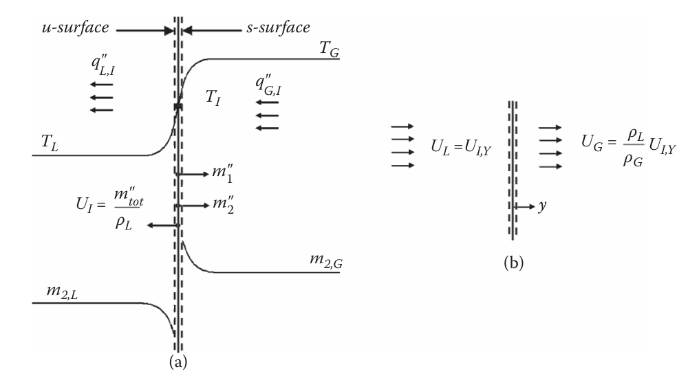

# Introduction

When mass flows through a wall, it modifies the velocity, thermal, and concentration boundary layer profiles, thereby modifying the frictional, thermal, and mass transfer resistances. If the diffusion of species $1$ is Fickian and does not affect the energy equation, the wall boundary conditions are

$$
\begin{aligned}
\tau_s & =\mu\left.\frac {\partial\overline u}{\partial y}\right|_{y=0} \\
q_s'' & =n_s(\textbf h_s^*-\textbf h_b^*)-\left.k\frac {k\partial\overline T}{\partial y}\right|_{y=0} \\
m_{1,s}'' & =n_sm_{1,s}-\left.\rho\mathfrak D_{12}\frac {\partial\overline m_1}{\partial y}\right|_{y=0}
\end{aligned}
$$

where $n_s$ is the mass flux through the wall, $\textbf h_s^*$ is the total enthalpy of the fluid mixture at the wall, $\textbf h_b^*$ is the total enthalpy of species $1$, $m_1$ is the mass fraction of species $1$, and $\mathfrak D_{12}$ is the mass diffusivity of species $1$ with respect to the mixture (species $2$). For blowing and suction, $n_s>0$ and $n_s<0$ respectively. Typically, since kinetic energy contribution of species $1$ on species $2$ is negligible, $\textbf h^*=\overline{\textbf h}$.

# Couette Flow Film Model

For engineering, use the Couette film model to account for effects of transpiration. Defining $\dot C_f$, $\dot h$, and $\dot{\mathfrak K}$ as the coefficients of skin friction, heat transfer coefficient, and mass transfer coefficient respectively, then

$$
\begin{aligned}
\tau_s & =\frac 12\rho\dot C_fU_{\infty}^2 \\
\left.-k\frac {\partial T}{\partial y}\right|_{y=0} & =\dot h(T_s-T_{\infty}) \\
\left.-\rho\mathfrak D_{12}\frac {\partial m_1}{\partial y}\right|_{y=0} & =\dot{\mathfrak K}(m_{1,s}-m_{1,\infty})
\end{aligned}
$$

The dot implies a modified parameter for mass transpiration. Explicit and implicit equations for calculating each parameter is given below. Derivations for $\dot C_f$ and $\dot h$ are given in @sec-couette-film-model-wall-friction and @sec-couette-film-model-heat-transfer-coefficient respectively. The **explicit** formulations are

$$
\begin{aligned}
\frac {\dot C_f}{C_f} & =\frac {\beta}{\beta-1}\qquad & \qquad & \beta=\frac {2n_s}{\rho U_{\infty}C_f} \\
\frac {\dot h}h & =\frac {\beta_{\mathrm{th}}}{e^{\beta_{\mathrm{th}}}-1}\qquad & \qquad & \beta_{\mathrm{th}}=\frac {n_sC_p}h \\
\frac {\dot{\mathfrak K}}{\mathfrak K} & =\frac {\beta_{\mathrm{ma}}}{e^{\beta_{\mathrm{ma}}}-1}\qquad & \qquad & \beta_{\mathrm{ma}}=\frac {n_s}{\mathfrak K} \\
\frac {\dot{\tilde{\mathfrak K}}}{\tilde{\mathfrak K}} & =\frac {\tilde{\beta}_{\mathrm{ma}}}{e^{\tilde{\beta}_{\mathrm{ma}}}-1}\qquad & \qquad & \tilde{\beta}_{\mathrm{ma}}=\frac {N_s''}{\tilde{\mathfrak K}}
\end{aligned}
$$ {#eq-couette-film-model-parameters-explicit}

The **implicit** formulations must be solved iteratively

$$
\begin{aligned}

\end{aligned}
$$

## Wall Friction {#sec-couette-film-model-wall-friction}

## Heat Transfer Coefficient {#sec-couette-film-model-heat-transfer-coefficient}

# Gas-Liquid Interphase

At the interface between the gas and liquid, the heat and mass transfer resistance there is negligible small. Therefore, it can be assumed the interphase is in equilibrium. The interfacial transfer processes are controlled by thermal and mass transfer resistances between the bulk liquid and liquid-side interphase, as well as the bulk gas and gas-side interphase.

Consider the situation where a hot, gaseous substance $2$ and a cooler, liquid substance $1$ are mixed together. If the gas-liquid interphase is treated as a flat surface, the evaporation of the species $1$ liquid and mixing of dissolved species $2$ gas simultaneously is given in @fig-gas-liquid-evaporation-interphase-setup. The coordinate system is origin is placed along the interphase, with the $y$ axis pointing towards the bulk gas. Subscripts $\mathrm L$ and $\mathrm G$ denote liquid and gaseous properties respectively.

{#fig-gas-liquid-evaporation-interphase-setup width=750 .lightbox}

Assuming the mass flux of species $1$, $m_1''$, is known (we treat the unknown case later), then $m_{\mathrm{tot}}''=m_1''+m_2''$ and the mass flux of species $2$ can be written as

$$
m_2''=(1-m_{1,u})m_{\mathrm{tot}}''-\left.\rho_{L,u}\mathfrak D_{12,L}\frac {\partial\overline m_2}{\partial y}\right|_{u}
$$ {#eq-mass-flux-species-2}

Sensible (temperature rise) and latent (phase change) heat transfer take place on both sides of the interphase during evaporation. Mass from the liquid side will evaporate and evacuate towards the gas side. This velocity, $U_{I,y}$ is

$$
U_{I,y}=frac {m_{\mathrm{tot}}''}{\rho_L}
$$

# Transpiration and Sweat Cooling

Transpiration cooling involves the flow of a gas or liquid coolant through a heated perforated or porous medium to cool the internal hot-gas surface. This type of cooling is used under high thermal loading that includes a significant amount of convective heat transfer into the neighboring surfaces. The coolant absorbs not only some of the energy in the solid, but also reduces the convective heat flux to the surface, before being convected away into the hot-gas freestream. Adjusting the transpiration cooling flow rate can raise or lower the surface temperature.

::: {.callout-note title=""}

Transpiration cooling involves both conductive (through the wall) and convective (at the fluid-wall interface) heat transfer. Higher coolant specific heats and lower molecular mass improve the cooling power of the coolant. Higher $C_p$ translates to a larger enthalpy rise may be accommodated before complete evaporation into a gas, and a lower molecular mass results in larger velocities for a fixed $\dot m$. This directly enhances convective cooling through advective means.

:::

Sweat cooling is similar to transpiration, but the liquid coolant permeating through the porous medium evaporates at the surface. The flow rate of the coolant through the walls is such that the heated surface remains wet during steady state. Since the latent heat of vaporization is so large for liquids, only a small amount of flow is typically needed to achieve a wet heated surface.