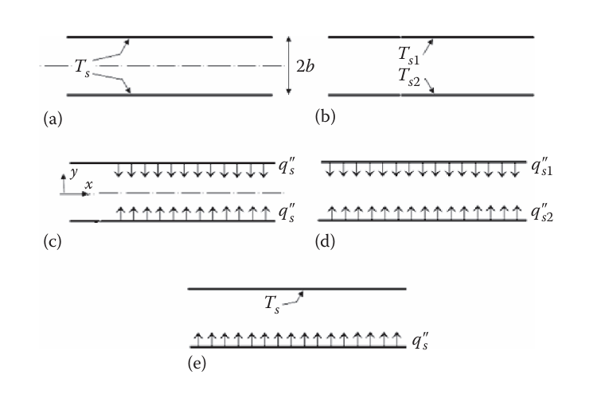

# Flat Plate

## Friction Factor

## Heat Transfer Coefficient

**Reynolds:** Smooth surface

$$
\mathrm{Nu}_x=\frac 12\mathrm{Re}_xC_{f,x}\tag{9.2.10}
$$

### Laminar Flow

**Reynolds:** Smooth surface

$$
\mathrm{Nu}_x=\frac 12\mathrm{Re}_xC_{f,x}\tag{9.2.10}
$$

### Turbulent Flow

**Prandtl-Taylor (1916):** Smooth surface, $\mathrm{Pr}=\mathrm{Pr}_{\mathrm{tu}}\approx1$, viscous sublayer and fully turbulent sublayer in the boundary layer, laminar-like sublayers (viscous and buffer zone) extend to $\delta_{\mathrm{lam}}^+=\frac {\delta_{\mathrm{lam}U_{\tau}}}{\nu}=5$

$$
\mathrm{Nu}_x=\frac {0.5C_f\mathrm{Re}_x\mathrm{Pr}}{1+5\sqrt{\frac {C_f}2}(\mathrm{Pr}-1)}\tag{9.3.9}
$$

**Prandtl-Taylor (1916):** Smooth surface, $\mathrm{Pr}=\mathrm{Pr}_{\mathrm{tu}}\approx1$, viscous sublayer and fully turbulent sublayer in the boundary layer, laminar-like sublayers (viscous and buffer zone) extend to $\delta_{\mathrm{lam}}^+=\frac {\delta_{\mathrm{lam}U_{\tau}}}{\nu}=9$ (more realistic)

$$
\mathrm{Nu}_x=\frac {0.029\mathrm{Re}_x^{0.8}\mathrm{Pr}}{1+1.525\mathrm{Re}_x^{-0.1}(\mathrm{Pr}-1)}\tag{9.3.13}
$$

**von-Karman (1939):** Smooth surface, valid for $\mathrm{Pr}\lesssim40$

$$
\mathrm{Nu}_x=\frac {0.5C_f\mathrm{Re}_x\mathrm{Pr}\mathrm{Pr}_{\mathrm{tu}}^{-1}}{1+5\sqrt{\frac {C_f}2}\left\{\left(\mathrm{Pr}\mathrm{Pr}_{\mathrm{tu}}^{-1}-1\right)+\ln\left[1+\frac 56\left(\mathrm{Pr}\mathrm{Pr}_{\mathrm{tu}}^{-1}-1\right)\right]\right\}}\tag{9.4.9}
$$

## Mass Transfer

### Turbulent Flow

**Reynolds:** Smooth surface, if $\mathrm{Sh}_x=\frac {\mathfrak K_x}{\rho\mathfrak D_{12}}$ where $\mathfrak D_{12}$ is the diffusivity of the transferred species in the mixture

$$
\mathrm{Sh}_x=\frac 12\mathrm{Re}_x\mathrm{Sc}\tag{9.2.13}
$$

**Prandtl-Taylor (1916):** Smooth surface, $\mathrm{Pr}=\mathrm{Pr}_{\mathrm{tu}}\approx1$, boundary layer composed of viscous sublayer and fully turbulent layer, laminar-like sublayers (viscous and buffer zone) extend to $\delta_{\mathrm{lam}}^+=\frac {\delta_{\mathrm{lam}U_{\tau}}}{\nu}=5$

$$
\mathrm{Sh}_x=\frac {0.5C_f\mathrm{Re}_x\mathrm{Sc}}{1+5\sqrt{\frac {C_f}2}(\mathrm{Sc}-1)}\tag{9.3.10}
$$

**Prandtl-Taylor (1916):** Smooth surface, $\mathrm{Pr}=\mathrm{Pr}_{\mathrm{tu}}\approx1$, viscous sublayer and fully turbulent sublayer in the boundary layer, laminar-like sublayers (viscous and buffer zone) extend to $\delta_{\mathrm{lam}}^+=\frac {\delta_{\mathrm{lam}U_{\tau}}}{\nu}=9$ (more realistic)

$$
\mathrm{Sh}_x=\frac {0.029\mathrm{Re}_x^{0.8}\mathrm{Sc}}{1+1.525\mathrm{Re}_x^{-0.1}(\mathrm{Sc}-1)}\tag{9.3.14}
$$

**von-Karman (1939):** Smooth surface, valid for $\mathrm{Sc}\lesssim40$

$$
\mathrm{Sh}_x=\frac {0.5C_f\mathrm{Re}_x\mathrm{Sc}\mathrm{Sc}_{\mathrm{tu}}^{-1}}{1+5\sqrt{\frac {C_f}2}\left\{\left(\mathrm{Sc}\mathrm{Sc}_{\mathrm{tu}}^{-1}-1\right)+\ln\left[1+\frac 56\left(\mathrm{Sc}\mathrm{Sc}_{\mathrm{tu}}^{-1}-1\right)\right]\right\}}\tag{9.4.9}
$$

# Circular Channel

**Laminar:**

$$
\mathrm{Re}_D\lesssim2100
$$

**Transition:**

$$
2100<\mathrm{Re}_D<10^4
$$

**Turbulent:**

$$
\mathrm{Re}_D>10^4
$$

## Entrance Lengths

### Laminar Flow

**Chen (1973):** Smooth surface

$$
\frac {l_{\mathrm{ent,hy}}}D=\frac {0.60}{0.035\mathrm{Re}_D+1}+0.056\mathrm{Re}_D\tag{4.2.12}
$$

**Analytical:** Smooth surface

$$
\frac {l_{\mathrm{ent,th}}}D\approx0.05\mathrm{Re}_D\mathrm{Pr}\tag{4.5.30}
$$

### Turbulent Flow

**Experimental:** For $\mathrm{Pr}\approx1$ or $\mathrm{Sc}\approx1$ fluids

$$
\begin{aligned}
\frac {l_{\mathrm{ent,hy}}}D & \approx10 \\
\frac {l_{\mathrm{ent,th}}}D & \approx10 \\
\frac {l_{\mathrm{ent,ma}}}D & \approx10
\end{aligned}\tag{7.1.4}
$$

**Wang (1982):** Smooth surface, flat inlet velocity profile, $\frac 17$ power law velocity profile

$$
\frac {l_{\mathrm{ent,hy}}}D=1.3590\mathrm{Re}_D^{1/4}\tag{7.2.3}
$$

## Fully Developed Flow

### Profiles

#### Laminar Flow

**Hagen-Poiseuille (1840):** Smooth surface

$$
\begin{aligned}
u(r) & =2U_m\left[1-\left(\frac r{R_0}\right)^2\right] \\
U_m & =\frac {R_0^2}{8\mu}\left(-\frac {\mathrm dP}{\mathrm dx}\right)
\end{aligned}\tag{4.3.2}
$$

#### Turbulent Flow {#sec-circular-fully-developed-flow-profiles-turbulent}

**Wang (1982):** Smooth surface, flat inlet velocity profile, $\frac 17$ power law velocity profile

$$
\frac {x/D}{\mathrm{Re}_D^{1/4}}=1.4039\left(\frac {\delta}{R_0}\right)^{5/4}\left[1+0.1577\left(\frac {\delta}{R_0}\right)-0.1793\left(\frac {\delta}{R_0}\right)^2-0.0168\left(\frac {\delta}{R_0}\right)^3+0.0064\left(\frac {\delta}{R_0}\right)^4\right]\tag{7.2.2}
$$

**Nikuradse (1932):** Smooth surface, $n$ power law velocity profile, valid for $y^+>30$

$$
\begin{aligned}
\frac {\overline u}{U_{\mathrm{max}}} & =\left(\frac y{R_0}\right)^{1/n} \\
\frac {U_m}{U_{\mathrm{max}}} & =\frac {2n^2}{(n+1)(2n+1)}
\end{aligned}\tag{7.2.6}
$$

where

| $\mathrm{Re}_D$ | $4000$ | $2.3\times10^3$ | $1.1\times10^5$ | $1.1\times10^6$ | $2.0\times10^6$ | $3.2\times10^6$ |
|:---------------:|:------:|:---------------:|:---------------:|:---------------:|:---------------:|:--------------:|
|       $n$       |   $6$  |      $6.6$      |       $7$       |      $8.8$      |       $10$      |      $10$      |

**Prandtl (1933):** Smooth surface, valid for $y^+>30$

$$
\frac {U_{\mathrm{max}}-\overline u}{U_{\tau}}=2.5\ln\left(\frac {R_0}y\right)\tag{7.2.8}
$$

**Wang (1946):** Smooth surface

$$
\frac {U_{\mathrm{max}}-\overline u}{U_{\tau}}=2.5\left[\ln\left(\frac {1+\sqrt{1-\frac y{R_0}}}{1-\sqrt{1-\frac y{R_0}}}\right)-2\arctan\left(\sqrt{1-\frac y{R_0}}\right)-0.572\ln\left(\frac {2.53-\frac y{R_0}+1.75\sqrt{1-\frac y{R_0}}}{2.53-\frac y{R_0}-1.75\sqrt{1-\frac y{R_0}}}\right)+1.143\arctan\left(\frac {1.75\sqrt{1-\frac y{R_0}}}{0.53+\frac y{R_0}}\right)\right]\tag{7.2.9}
$$

**Yu et al. (2001):** Smooth surface, valid for $150<R_0^+<50,000$ where $R_0^+=\frac {U_{\tau}R_0}{\nu}$ and $U_{\tau}=\sqrt{\frac {\tau_s}{\rho}}$

$$
U_m^+=3.2-\frac {227}{R_0^+}+\left(\frac {50}{R_0^+}\right)^2+\frac 1{0.436}\ln R_0^+\tag{7.2.34}
$$

**Yu et al. (2001):** Smooth surface, valid for $R_0^+>500$ where $R_0^+=\frac {U_{\tau}R_0}{\nu}$ and $U_{\tau}=\sqrt{\frac {\tau_s}{\rho}}$

$$
U_{\mathrm{CL}}^+=7.52+\frac 1{0.436}\ln R_0^+
$$

**White (2006):** Smooth surface, $\kappa=0.4$ and $B=5.5$, valid for $R_0^+>30$

$$
U_m^+=\frac 1{\kappa}\ln R_0^++B-\frac 3{2\kappa}
$$

### Friction Factor

#### Laminar Flow

**Hagen-Poiseuille (1840):** Smooth surface

$$
f=4C_f=\frac {64}{\mathrm{Re}_D}\tag{4.3.7}
$$

**Shah and London (1978):** Smooth surface, valid for all $x^*=\frac x{D\mathrm{Re}_D}$ range

$$
C_{f,\mathrm{app},x}\mathrm{Re}_D=\frac {3.44}{\sqrt{x^*}}+\frac 1{1+2.1\times10^{-4}\left(x^*\right)^{-2}}\left(\frac {1.25}{4x^*}+16-\frac {3.44}{\sqrt{x^*}}\right)\tag{4.2.13}
$$

#### Turbulent Flow

**Wang (1982):** Smooth surface, flat inlet velocity profile, $\frac 17$ power law velocity profile

$$
C_{f,\mathrm{app},x}\mathrm{Re}_D^{1/4}=\frac {(U_{\mathrm{max}}/U_m)^2-1}{4x/\left(4x\mathrm{Re}_D^{1/4}\right)}\tag{7.2.4}
$$

where

$$
\frac {U_m}{U_{\mathrm{max}}}=1-\frac 14\left(\frac {\delta}{R_0}\right)+\frac 1{15}\left(\frac {\delta}{R_0}\right)^2\tag{7.2.5}
$$

**White (2006):** Smooth surface, valid for all $R_0^+=\frac {U_{\tau}R_0}{\nu}$ where $U_{\tau}=\sqrt{\frac {\tau_s}{\rho}}$

$$
\frac 1{\sqrt{C_f}}=1.7272\ln\left(\mathrm{Re}_D\sqrt{C_f}\right)-0.395\tag{7.2.37}
$$

**Blasius (1913):** Smooth surface, $\frac 17$ power law velocity profile, valid for $\mathrm{Re}_D\lesssim10^5$

$$
C_f=0.079\mathrm{Re}_D^{-1/4}\tag{7.2.38}
$$

**White (2006):** Fully rough surface

$$
\frac 1{\sqrt f}=2.0\log_{10}\left(\frac {\mathrm{Re}_D\sqrt f}{1+0.1\mathrm{Re}_D\sqrt f\varepsilon_s/D}\right)-0.8\tag{7.2.40}
$$

**Colebrook (1939):** Fully rough surface, valid for $5\leq\varepsilon_s^+\leq70$

$$
\frac 1{\sqrt f}=-2.0\log_{10}\left(\frac {\varepsilon_s/D}{3.7}+\frac {2.51}{\mathrm{Re}_D\sqrt f}\right)\tag{7.2.41}
$$

**Haaland (1983):** Fully rough surface

$$
\frac 1{\sqrt f}=-1.8\log_{10}\left[\left(\frac {\varepsilon_s/D}{3.7}\right)^{1.11}+\frac {6.9}{\mathrm{Re}_D}\right]\tag{7.2.42}
$$

### Heat Transfer Coefficient

#### Laminar Flow

**Analytical:** Smooth surface, negligible axial conduction, negligible viscous dissipation

$$
\mathrm{Nu}_{D,\mathrm{UHF}}=\frac {48}{11}\approx4.364\tag{4.4.6}
$$

**Shah and London (1978):** With viscous dissipation and volumetric energy generation, if $q_v^*=\frac {\dot q_vD}{q_s''}$ and $\mathrm{Br}'=\frac {\mu U_m^2}{q_s'' D}$

$$
\mathrm{Nu}_{D,\mathrm{UHF}}=\frac {48}{11}\frac 1{1+\frac 3{44}q_v^*+\frac {48}{11}\mathrm{Br}'}\tag{4.4.9}
$$

**Analytical:** Smooth surface, negligible axial conduction, if $\lambda_0=2.70436442$

$$
\mathrm{Nu}_{D,\mathrm{UWT}}=\frac {\lambda_0^2}2=3.6568\tag{4.4.22}
$$

**Analytical:** Smooth surface, negligible axial conduction, negligible viscous dissipation, if $x^*=\frac x{D\mathrm{Re}\mathrm{Pr}}>0.0335$, temperature profile is

$$
\frac {T_m-T_s}{T_{\mathrm{in}}-T_s}=0.81905\exp\left(-2\lambda_0^2x^*\right)\tag{4.4.23}
$$

**Michelsen and Villadsen (1974):** Smooth surface, axial conduction, if $\mathrm{Pe}=\mathrm{Re}_D\mathrm{Pr}$

$$
\mathrm{Nu}_{D,\mathrm{UWT}}=\begin{cases}
3.6568\left(1+\frac {1.227}{\mathrm{Pe}^2}+\cdots\right) & \qquad\qquad\mathrm{Pe}>5 \\
4.1807(1-0.0439\mathrm{Pe}+\cdots) & \qquad\qquad\mathrm{Pe}<1.55
\end{cases}
$$

#### Turbulent Flow

**Norris (1970):** Rough surfacess (accounted for in $C_f$)

$$
\frac {\mathrm{Nu}_{D_H}}{\mathrm{Nu}_{D_H,\mathrm{smooth}}}=\min\left[\left(\frac {C_f}{C_{f,\mathrm{smooth}}}\right)^n,4^n\right]\tag{7.1.1}
$$

where

$$
n=\begin{cases}
0.68\mathrm{Pr}^{0.215} & \qquad\qquad\mathrm{Pr}<6 \\\\
1 & \qquad\qquad\mathrm{Pr}>6
\end{cases}\tag{7.1.2}
$$

**Yu et al. (2001):** Smooth surface, all thermal boundary conditions, valid for $R_0^+>500$ and $\mathrm{Pr}>\mathrm{Pr}_{\mathrm{tu}}$

$$
\begin{aligned}
\mathrm{Nu}_{D_H} & =\frac 1{\frac 1{\mathrm{Nu}_{D_H,1}}\frac {\mathrm{Pr}_{\mathrm{tu}}}{\mathrm{Pr}}+\frac 1{\mathrm{Nu}_{D_H,\infty}}\left[1-\left(\frac {\mathrm{Pr}_{\mathrm{tu}}}{\mathrm{Pr}}\right)^{2/3}\right]} \\
\mathrm{Nu}_{D_H,\infty} & =0.07343\mathrm{Re}_{D_H}\left(\frac {\mathrm{Pr}}{\mathrm{Pr}_{\mathrm{tu}}}\right)^{1/3}\left(\frac {C_f}2\right)^{1/2} \\
\mathrm{Pr}_{\mathrm{tu}} & =0.85+0.015\mathrm{Pr}^{-1}
\end{aligned}\tag{9.6.6}
$$

For uniform wall temperature or uniform heat flux boundaries, $\mathrm{Nu}_{D_H,1}$ is

$$
\begin{aligned}
\mathrm{Nu}_{D_H,1,\mathrm{UWT}} & =\frac {\mathrm{Re}_{D_H}C_f/2}{1+145\left(U_m^+\right)^{-2/5}} \\
\mathrm{Nu}_{D_H,1,\mathrm{UHF}} & =\frac {\mathrm{Re}_{D_H}C_f/2}{1+195\left(U_m^+\right)^{-2.7}}
\end{aligned}\tag{9.6.9}
$$

The dimensionless mean velocity, $U_m^+$, see Yu et al. (2001)'s correlation in @sec-circular-fully-developed-flow-profiles-turbulent.

**Chilton and Colburn (1934):** Smooth surface, valid for $10^4<\mathrm{Re}_D<3\times10^5$ and $0.6<\mathrm{Pr}<100$

$$
j_{\mathrm{th}}=\mathrm{St}\mathrm{Pr}^{2/3}=\frac {\mathrm{Nu}_l}{\mathrm{Re}_l\mathrm{Pr}^{1/3}}=\frac {C_f}2\tag{9.7.8}
$$

**Prandtl-Taylor (1916):** Smooth surface, $\mathrm{Pr}=\mathrm{Pr}_{\mathrm{tu}}\approx1$, viscous sublayer and fully turbulent sublayer in the boundary layer, laminar-like sublayers (viscous and buffer zone) extend to $\delta_{\mathrm{lam}}^+=\frac {\delta_{\mathrm{lam}U_{\tau}}}{\nu}=5$

$$
\mathrm{Nu}_x=\frac {0.5C_f\mathrm{Re}_x\mathrm{Pr}}{1+5\sqrt{\frac {C_f}2}(\mathrm{Pr}-1)}\tag{9.3.9}
$$

**Prandtl-Taylor (1916):** Smooth surface, $\mathrm{Pr}=\mathrm{Pr}_{\mathrm{tu}}\approx1$, viscous sublayer and fully turbulent sublayer in the boundary layer, laminar-like sublayers (viscous and buffer zone) extend to $\delta_{\mathrm{lam}}^+=\frac {\delta_{\mathrm{lam}U_{\tau}}}{\nu}=9$ (more realistic)

$$
\mathrm{Nu}_x=\frac {0.029\mathrm{Re}_x^{0.8}\mathrm{Pr}}{1+1.525\mathrm{Re}_x^{-0.1}(\mathrm{Pr}-1)}\tag{9.3.13}
$$

**von-Karman (1939):** Smooth surface, valid for $\mathrm{Pr}\lesssim40$

$$
\mathrm{Nu}_x=\frac {0.5f\mathrm{Re}_{D_H}\mathrm{Pr}\mathrm{Pr}_{\mathrm{tu}}^{-1}}{1+5\sqrt{\frac {C_f}2}\left\{\left(\mathrm{Pr}\mathrm{Pr}_{\mathrm{tu}}^{-1}-1\right)+\ln\left[1+\frac 56\left(\mathrm{Pr}\mathrm{Pr}_{\mathrm{tu}}^{-1}-1\right)\right]\right\}}\tag{9.4.9}
$$

### Mass Transfer

#### Turbulent Flow

**Chilton and Colburn (1934):** Smooth surface, valid for $2000<\mathrm{Re}_D<3\times10^5$ and $0.6<\mathrm{Sc}<2500$

$$
j_{\mathrm{ma}}=\mathrm{St}\mathrm{Sc}^{2/3}=\frac {\mathrm{Sh}_l}{\mathrm{Re}_l\mathrm{Sc}^{1/3}}=\frac {C_f}2\tag{9.7.9}
$$

**Prandtl-Taylor (1916):** Smooth surface, $\mathrm{Pr}=\mathrm{Pr}_{\mathrm{tu}}\approx1$, boundary layer composed of viscous sublayer and fully turbulent layer, laminar-like sublayers (viscous and buffer zone) extend to $\delta_{\mathrm{lam}}^+=\frac {\delta_{\mathrm{lam}U_{\tau}}}{\nu}=5$

$$
\mathrm{Sh}_x=\frac {0.5C_f\mathrm{Re}_x\mathrm{Sc}}{1+5\sqrt{\frac {C_f}2}(\mathrm{Sc}-1)}\tag{9.3.10}
$$

**Prandtl-Taylor (1916):** Smooth surface, $\mathrm{Pr}=\mathrm{Pr}_{\mathrm{tu}}\approx1$, viscous sublayer and fully turbulent sublayer in the boundary layer, laminar-like sublayers (viscous and buffer zone) extend to $\delta_{\mathrm{lam}}^+=\frac {\delta_{\mathrm{lam}U_{\tau}}}{\nu}=9$ (more realistic)

$$
\mathrm{Sh}_x=\frac {0.029\mathrm{Re}_x^{0.8}\mathrm{Sc}}{1+1.525\mathrm{Re}_x^{-0.1}(\mathrm{Sc}-1)}\tag{9.3.14}
$$

**von-Karman (1939):** Smooth surface, $\mathrm{Sc}\lesssim40$

$$
\mathrm{Sh}_x=\frac {0.5f\mathrm{Re}_{D_H}\mathrm{Sc}\mathrm{Sc}_{\mathrm{tu}}^{-1}}{1+5\sqrt{\frac {C_f}2}\left\{\left(\mathrm{Sc}\mathrm{Sc}_{\mathrm{tu}}^{-1}-1\right)+\ln\left[1+\frac 56\left(\mathrm{Sc}\mathrm{Sc}_{\mathrm{tu}}^{-1}-1\right)\right]\right\}}\tag{9.4.9}
$$

## Developed Hydrodynamic, Thermal Entrance Region

This section covers developed hydrodynamic, thermally developing flows.

### Heat Transfer Coefficient

#### Laminar Flow

**Analytical:** Smooth surface, negligible axial conduction, negligible viscous dissipation

$$
\begin{aligned}
\mathrm{Nu}_{D,\mathrm{UWT}} & =1.077\left(\frac {2R_0}x\right)^{1/3}(\mathrm{Re}_D\mathrm{Pr})^{1/3} \\
\langle\mathrm{Nu}_{D,\mathrm{UWT}}\rangle & =1.615\left(\frac {2R_0}x\right)^{1/3}(\mathrm{Re}_D\mathrm{Pr})^{1/3}
\end{aligned}\tag{4.5.43a}
$$

**Muzychka et al. (2011):** Smooth surface, negligible axial conduction, negligible viscous dissipation

$$
\langle\mathrm{Nu}_{D,\mathrm{UWT}}\rangle_x=\left[\left(1.615\left(\frac {2R_0}x\right)^{1/3}(\mathrm{Re}_D\mathrm{Pr})^{1/3}\right)^5+3.65^5\right]^{1/5}\tag{4.5.43b}
$$

**Muzychka et al. (2011):** Smooth surface, negligible axial conduction, negligible viscous dissipation, $\mathrm{Pe}\to0$ (i.e., slug flow)

$$
\langle\mathrm{Nu}_{D,\mathrm{UWT}}\rangle_x=\left[\left(1.128\left(\frac {2R_0}x\right)^{0.5}(\mathrm{Re}_D\mathrm{Pr})^{0.5}\right)^2+5.78^2\right]^{1/2}\tag{4.5.43c}
$$

**Gnielinski (2010):** Smooth surface, negligible axial conduction, negligible viscous dissipation, uniform heat flux, if $x^*=\frac x{D\mathrm{Re}_D\mathrm{Pr}}\ll1$

$$
\begin{aligned}
\mathrm{Nu}_{D,\mathrm{UHF}}(x) & =\left[\mathrm{Nu}_{D,\mathrm{UHF},1}^3+1+(\mathrm{Nu}_{D,\mathrm{UHF},2}-1)^3\right]^{1/3} \\
\mathrm{Nu}_{D,\mathrm{UHF},1} & =4.364 \\
\mathrm{Nu}_{D,\mathrm{UHF},2} & =1.302(x^*)^{-1/3}
\end{aligned}\tag{4.5.139}
$$

**Gnielinski (2010):** Smooth surface, negligible axial conduction, negligible viscous dissipation, uniform heat flux, if $x^*=\frac x{D\mathrm{Re}_D\mathrm{Pr}}\ll1$

$$
\begin{aligned}
\langle\mathrm{Nu}_{D,\mathrm{UHF}}\rangle_x & =\left[\mathrm{Nu}_{D,\mathrm{UHF},1}^3+0.6^3+\left(\langle\mathrm{Nu}_{D,\mathrm{UHF},2}\rangle_x-0.6\right)^3\right]^{1/3} \\
\mathrm{Nu}_{D,\mathrm{UHF},1} & =4.364 \\
\langle\mathrm{Nu}_{D,\mathrm{UHF},2}\rangle_x & =1.953(x^*)^{-1/3}
\end{aligned}\tag{4.5.141}
$$

**Gnielinski (2010):** Smooth surface, negligible axial conduction, negligible viscous dissipation, uniform wall temperature, if $x^*=\frac x{D\mathrm{Re}_D\mathrm{Pr}}\ll1$

$$
\begin{aligned}
\mathrm{Nu}_{D,\mathrm{UWT}}(x) & =\left[\mathrm{Nu}_{D,\mathrm{UWT},1}^3+0.7^3+(\mathrm{Nu}_{D,\mathrm{UWT},2}-0.7)^3\right]^{1/3} \\
\mathrm{Nu}_{D,\mathrm{UWT},1} & =3.6568 \\
\mathrm{Nu}_{D,\mathrm{UWT},2} & =1.077(x^*)^{-1/3}
\end{aligned}\tag{4.5.135}
$$

**Gnielinski (2010):** Smooth surface, negligible axial conduction, negligible viscous dissipation, uniform wall temperature, if $x^*=\frac x{D\mathrm{Re}_D\mathrm{Pr}}\ll1$

$$
\begin{aligned}
\langle\mathrm{Nu}_{D,\mathrm{UWT}}\rangle_x & =\left[\mathrm{Nu}_{D,\mathrm{UWT},1}^3+0.7^3+\left(\langle\mathrm{Nu}_{D,\mathrm{UWT},2}\rangle_x-0.7\right)^3\right]^{1/3} \\
\mathrm{Nu}_{D,\mathrm{UWT},1} & =3.6568 \\
\langle\mathrm{Nu}_{D,\mathrm{UWT},2}\rangle_x & =1.615(x^*)^{-1/3}
\end{aligned}\tag{4.5.137}
$$

## Combined Entrance Region

# Rectangular Channel

## Entrance Lengths

## Fully Developed Flow

### Hagen-Poiseuille Flow

For smooth surfaces, if $a$ is longer duct side length to center plane

$$
u(y,z)=\frac {16a^2}{\pi^3\mu}\left(-\frac {\mathrm dP}{\mathrm dx}\right)\sum\limits_{j\text{ odd}}^{\infty}(-1)^{(j-1)/2}\left[1-\frac {\cosh\left(\frac {j\pi y}{2a}\right)}{\cosh\left(\frac {j\pi b}{2a}\right)}\right]\cos\left(\frac {j\pi z}{2a}\right)\tag{4.3.14}
$$

Mean velocity, $U_m$, is

$$
U_m=\frac {a^2}{3\mu}\left(-\frac {\mathrm dP}{\mathrm dx}\right)\left[1-\frac {192a}{\pi^5b}\sum\limits_{j\text{ odd}}^{\infty}\frac 1{j^5}\tanh\left(\frac {j\pi b}{2a}\right)\right]\tag{4.3.15}
$$

If $\mathrm{Re}_{D_H}=\frac {U_mD_H}{\nu}$ and $\alpha^*=\frac ba\leq1$

$$
C_f\mathrm{Re}_{D_H}=\frac {24}{\left(1+\frac 1{\alpha^*}\right)^2\left[1-\frac {192}{\pi^5\alpha^*}\sum\limits_{j\text{ odd}}\frac 1{j^5}\tanh\left(\frac {j\pi\alpha^*}2\right)\right]}\tag{4.3.16}
$$

**Shah and Bhatti (1987)** give curve fit as

$$
C_f\mathrm{Re}_{D_H}\approx24\left[1-1.3553\alpha^*+1.9467(\alpha^*)^2-1.7012(\alpha^*)^3+0.9564(\alpha^*)^4-0.2537(\alpha^*)^5\right]\tag{4.3.17}
$$

### Heat Transfer Coefficient

#### Turbulent Flow

**Yu et al. (2001):** Smooth surface, all thermal boundary conditions, valid for $R_0^+>500$ and $\mathrm{Pr}>\mathrm{Pr}_{\mathrm{tu}}$

$$
\begin{aligned}
\mathrm{Nu}_{D_H} & =\frac 1{\frac 1{\mathrm{Nu}_{D_H,1}}\frac {\mathrm{Pr}_{\mathrm{tu}}}{\mathrm{Pr}}+\frac 1{\mathrm{Nu}_{D_H,\infty}}\left[1-\left(\frac {\mathrm{Pr}_{\mathrm{tu}}}{\mathrm{Pr}}\right)^{2/3}\right]} \\
\mathrm{Nu}_{D_H,\infty} & =0.07343\mathrm{Re}_{D_H}\left(\frac {\mathrm{Pr}}{\mathrm{Pr}_{\mathrm{tu}}}\right)^{1/3}\left(\frac {C_f}2\right)^{1/2} \\
\mathrm{Pr}_{\mathrm{tu}} & =0.85+0.015\mathrm{Pr}^{-1}
\end{aligned}
$$

The quantity $\mathrm{Nu}_{D_H,1}$ should be calculated based off whether the boundary is a uniform wall temperature or uniform heat flux boundary.

$$
\begin{aligned}
\mathrm{Nu}_{D_H,1,\mathrm{UWT}} & =\frac {\mathrm{Re}_{D_H}C_f/2}{1+145\left(U_m^+\right)^{-2/5}} \\
\mathrm{Nu}_{D_H,1,\mathrm{UHF}} & =\frac {\mathrm{Re}_{D_H}C_f/2}{1+195\left(U_m^+\right)^{-2.7}}
\end{aligned}
$$

# Flat Channel

## Entrance Lengths

### Laminar Flow

**Chen (1973):** Smooth surface, Reynolds number defined as $\mathrm{Re}_{D_H}=\frac {U_mD_H}{\nu}$

$$
\frac {l_{\mathrm{ent,hy}}}{D_H}=0.011\mathrm{Re}_{D_H}+\frac {0.315}{1+0.0175\mathrm{Re}_{D_H}}\tag{4.2.15}
$$

**Analytical:** Smooth surface

$$
\frac {l_{\mathrm{ent,th,UHF}}}{D_H}=0.0115439\mathrm{Re}_{D_H}\mathrm{Pr}\tag{4.5.100}
$$

**Analytical:** Smooth surface

$$
\frac {l_{\mathrm{ent,th,UWT}}}{D_H}=0.00797\mathrm{Re}_{D_H}\mathrm{Pr}
$$

**Analytical:** Smooth surface

$$
\frac {l_{\mathrm{ent,ma,UMF}}}{D_H}=0.0115\mathrm{Re}_{D_H}\mathrm{Sc}\tag{4.5.107}
$$

### Turbulent Flow

## Fully Developed Flow

### Hagen-Poiseuille Flow

Center defined as midplane, both surfaces are a distance $b$ from the center line. If a smooth surface and $U_m=\frac 1{3\mu}\left(-\frac {\mathrm dP}{\mathrm dx}\right)$

$$
u(y)=\frac {b^2}{2\mu}\left(-\frac {\mathrm dP}{\mathrm dx}\right)\left[1-\left(\frac yb\right)\right]\tag{4.3.11}
$$

If $\mathrm{Re}_{D_H}=\frac {U_mD_H}{\nu}$

$$
C_f\mathrm{Re}_{D_H}=24\tag{4.3.13}
$$

### Friction Factor

#### Laminar Flow

**Shah and London (1978):** Smooth surface, Reynolds number defined as $\mathrm{Re}_{D_H}=\frac {U_mD_H}{\nu}$

$$
C_{f,\mathrm{app},x}\mathrm{Re}_{D_H}=\frac {3.44}{(x^*)^{1/2}}+\frac {24+\frac {0.674}{4x^*}-\frac {3.44}{(x^*)^{1/2}}}{1+0.000029(x^*)^{-2}}\tag{4.2.16}
$$

**Hagen-Poiseuille (1840):** Smooth surface, Reynolds number defined as $\mathrm{Re}_{D_H}=\frac {U_mD_H}{\nu}$

$$
C_f\mathrm{Re}_{D_H}=24\tag{4.3.13}
$$

#### Turbulent Flow

### Heat Transfer Coefficient

Refer to the five wall boundary conditions for flat channel: (a) equal and constant surface temperature, (b) unequal and constant surface temperature, (c) equal and constant heat flux, (d) unequal and constant heat flux, (e) one surface constant temperature and the other constant heat flux

{#fig-flat-channel-thermal-boundary-conditions width=550 .lightbox}

#### Laminar Flow

**Analytical:** Smooth surface, negligible axial conduction, uniform wall heat flux (Case C in @fig-flat-channel-thermal-boundary-conditions)

$$
\mathrm{Nu}_{D_H,\mathrm{UHF}}=\frac {140}{17}\approx8.235\tag{4.4.42}
$$

**Tyagi, (1966), Shah and London, (1978):** With viscous dissipation and volumetric energy generation, if $q_v^*=\frac {\dot q_vD_H}{q_s''}$ and $\mathrm{Br}'=\frac {\mu U_m^2}{q_s''D_H}$

$$
\mathrm{Nu}_{D_H,\mathrm{UHF}}=\frac {140}{17}\frac 1{1+\frac 3{68}q_v^*+\frac {108}{17}\mathrm{Br}'}\tag{4.4.43}
$$

**Analytical:** Smooth surface, negligible axial conduction, unequal and constant heat flux (Case C in @fig-flat-channel-thermal-boundary-conditions)

$$
\begin{aligned}
\mathrm{Nu}_{D_H,1} & =\frac {140}{26-9\frac {q_{s2}''}{q_{s1}''}} \\
\mathrm{Nu}_{D_H,2} & =\frac {140}{26-9\frac {q_{s1}''}{q_{s2}''}}
\end{aligned}\tag{4.4.47}
$$

**Analytical:** Smooth surface, negligible axial conduction, negligible viscous dissipation, one surface constant temperature and the other constant heat flux (Case E in @fig-flat-channel-thermal-boundary-conditions)

$$
\begin{aligned}
\mathrm{Nu}_{D_H,T} & =4 \\
\mathrm{Nu}_{D_H,q''} & =4
\end{aligned}\tag{4.4.49}
$$

**Cheng and Wu (1976):** Smooth surface, axial conduction, viscous dissipation, one surface constant temperature and the other constant heat flux (Case E in @fig-flat-channel-thermal-boundary-conditions), assume $T_{s1}>T_{s2}$, if $\mathrm{Br}=\frac {2\mu U_m^2}{k\left[\frac 12(T_{s1}+T_{s2})-T_m\right]}$

$$
\begin{aligned}
\mathrm{Nu}_{D_H,1} & =\frac {4(1-6\mathrm{Br})}{1-\frac {48}{35}\mathrm{Br}} \\
\mathrm{Nu}_{D_H,2} & =\frac {4(1+6\mathrm{Br})}{1-\frac {48}{35}\mathrm{Br}}
\end{aligned}\tag{4.4.56}
$$

**Analytical:** Smooth surface, negligible axial condution, uniform wall temperature (Case A in @fig-flat-channel-thermal-boundary-conditions)

$$
\mathrm{Nu}_{D_H,\mathrm{UWT}}=7.5407\tag{4.4.53}
$$

**Pahor and Strand (1961):** Smooth surface, axial conduction, if $\mathrm{Pe}=\mathrm{Re}_D\mathrm{Pr}$

$$
\mathrm{Nu}_{D_H,\mathrm{UWT}}=\begin{cases}
7.540\left(1+\frac {3.79}{\mathrm{Pe}^2}+\cdots\right) & \qquad\qquad\mathrm{Pe}\gg1 \\
8.118(1-0.031\mathrm{Pe}+\cdots) & \qquad\qquad\mathrm{Pe}\ll1
\end{cases}
$$

#### Turbulent Flow

## Developed Hydrodynamic, Thermal Entrance Region

### Heat Transfer Coefficient

#### Laminar Flow

**Shah and London (1978):** Smooth surface, negligible axial conduction, negligible viscous dissipation, if $x^*=\frac x{D_H\mathrm{Re}_{D_H}\mathrm{Pr}}$

$$
\begin{aligned}
\mathrm{Nu}_{D_H,\mathrm{UHF}}(x^*) & =\begin{cases}
1.490\left(x^*\right)^{-1/3} & \qquad x^*\leq2\times10^{-4} \\
1.490\left(x^*\right)^{-1/3}-0.4 & \qquad2\times10^{-4}<x^*\leq10^{-3} \\
8.235+8.68\left(x^*\times10^3\right)^{-0.506}e^{-164x^*} & \qquad x^*>10^{-3}
\end{cases} \\
\langle\mathrm{Nu}_{D_H,\mathrm{UHF}}\rangle_x & =\begin{cases}
2.236\left(x^*\right)^{-1/3} & \qquad\qquad\qquad\qquad x^*\leq10^{-3} \\
2.236\left(x^*\right)^{-1/3}+0.9 & \qquad\qquad\qquad\qquad10^{-3}<x^*\leq0.01 \\
8.235+0.0364\left(x^*\right)^{-1} & \qquad\qquad\qquad\qquad x^*>0.01
\end{cases}
\end{aligned}\tag{4.5.101}
$$

**Analytical:** Smooth surface, if $x^*=\frac x{D_H\mathrm{Re}_{D_H}\mathrm{Pr}}$

$$
\mathrm{Nu}_{D_H,\mathrm{UWT}}(x^*)=\frac 2{\Gamma\left(\frac 43\right)\left(6x^*\right)^{1/3}}\tag{4.5.127}
$$

**Shah and London (1978):** Smooth surface, if $x^*=\frac x{D_H\mathrm{Re}_{D_H}\mathrm{Pr}}$

$$
\begin{aligned}
\mathrm{Nu}_{D_H,\mathrm{UWT}}(x^*) & =\begin{cases}
1.233\left(x^*\right)^{-1/3}+0.4 & \qquad x^*\leq10^{-3} \\
7.541+6.874\left(x^*\times10^{-3}\right)^{-0.488}e^{-245x^*} & \qquad x^*>10^{-3}
\end{cases} \\
\langle\mathrm{Nu}_{D_H,\mathrm{UWT}}\rangle_x & =\begin{cases}
1.849\left(x^*\right)^{-1/3} & \qquad\qquad\qquad\qquad\quad x^*\leq5\times10^{-4} \\
1.849\left(x^*\right)^{-1/3}+0.6 & \qquad\qquad\qquad\quad\qquad5\times10^{-4}<x^*\leq0.006 \\
7.541+0.0235\left(x^*\right)^{-1} & \qquad\qquad\qquad\qquad\quad x^*>0.006
\end{cases}
\end{aligned}\tag{4.5.128}
$$

**Gnielinski (2010):** Smooth surface, negligible axial conduction, negligible viscous dissipation, $\frac {D_H\mathrm{Re}_{D_H}\mathrm{Pr}}x\gg1$

$$
\begin{aligned}
\langle\mathrm{Nu}_{D_H,\mathrm{UWT}}\rangle_x & =\left[\mathrm{Nu}_{D_H,\mathrm{UWT},1}^3+\mathrm{Nu}_{D_H,\mathrm{UWT},2}^3(x)\right]^{1/3} \\
\mathrm{Nu}_{D_H,\mathrm{UWT},1} & =7.5407 \\
\mathrm{Nu}_{D_H,\mathrm{UWT},2}(x) & =1.841\left(\frac {D_H\mathrm{Re}_{D_H}\mathrm{Pr}}x\right)^{1/3}
\end{aligned}\tag{4.5.143}
$$

#### Turbulent Flow

# Concentric Annular Duct

## Fully Developed Flow

### Hagen-Poiseuille Flow

Smooth surface, if $R_i$ and $R_0$ are the inner and outer radii respectively

$$
u(r)=\left[R_0^2-r^2+(R_0^2-R_i^2)\frac {\ln\left(r/R_0\right)}{\ln\left(R_0/R_i\right)}\right]\left(-\frac 1{4\mu}\frac {\mathrm dP}{\mathrm dx}\right)\tag{4.3.31}
$$

Mean velocity

# General Duct Geometries

## Friction Factor

### Laminar Flow

**Muzychka and Yovanovich (2004):** Smooth surface, Reynolds number defined as $\mathrm{Re}_{\sqrt A}=\frac {U_m\sqrt A}{\nu}$, dimensionless distance defined as $x^*=\frac x{\sqrt A\mathrm{Re}_{\sqrt A}}$, accurate to within $\pm10\%$

$$
C_{f,\mathrm{app},x}\mathrm{Re}_{\sqrt A}=\sqrt{\left(\frac {12}{\sqrt{\alpha^*}(1+\alpha^*)\left[1-\frac {192\alpha^*}{\pi^5}\tanh\left(\frac {\pi}{2\alpha^*}\right)\right]}\right)^2+\left(\frac {3.44}{\sqrt{x^*}}\right)^2}\tag{4.2.17}
$$