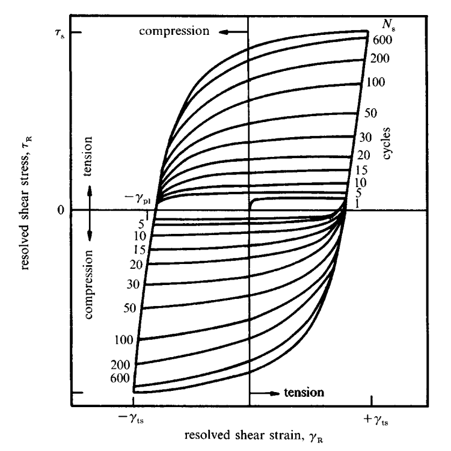

Rapid strain hardening occurs in ductile material subjected to fully reversed cyclic loading. This strain hardening is characterized by an increase in the flow stress as the cycle count is increased. This trend does not continue indefinitely, however, as at some point, *saturation* is achieved and and a steady stress and strain value are reached for each subsequent cycle. The resolved shear stress, $\tau_R$, and resolved shear strain, $\gamma_R$, remain constant at this point and the hysteresis loop develops a steady configuration.

{#fig-strain-hardening-ductile-hysteresis-loop width=550 .lightbox}

The total shear strain amplitude, $\gamma_t$, should not be used for conducting fatigue tests as the plastic shear strain component, $\gamma_{\mathrm{pl}}$, is typically very small as most of the strain is taken up by *reversible* slip. This is the elastic portion of the strain where the molecules are able to reversibly return back to their original positions in the material lattice structure. This contribution, furthermore, decreases as work hardening takes effect. Instead, fixed plastic strain amplitudes should be used instead.

A nominal measure of damage is the *cumulative plastic strain*, defined by

$$
\Gamma=4\sum\limits_{k=1}^N\gamma_{\mathrm{pl},i}
$$ {#eq-cumulative-plastic-strain-damage}

where $\gamma_{\mathrm{pl},i}$ is the plastic shear strain for the $i$th cycle and $N$ is the total number of cycles. For fully reversed loading under constant plastic strain amplitude $\gamma_{\mathrm{pl}}$, @eq-cumulative-plastic-strain-damage simplifies to $\Gamma=4\gamma_{\mathrm{pl}}N$.

# Cyclic Saturation in Single Crystals

