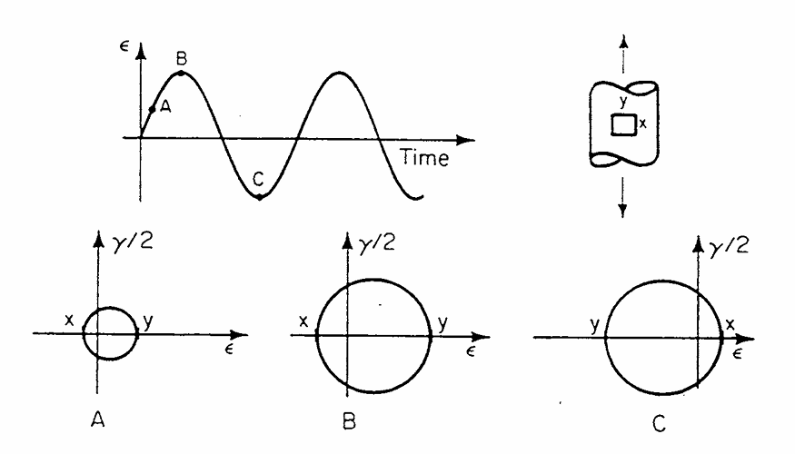
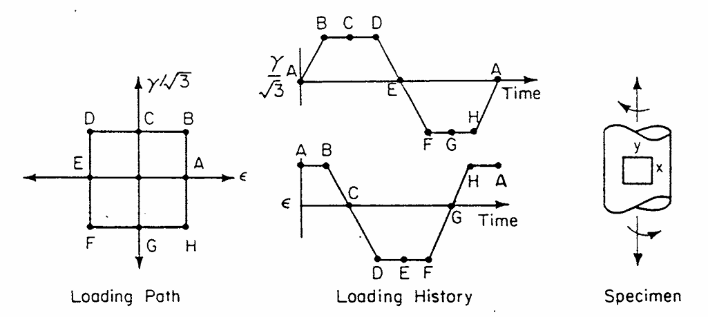
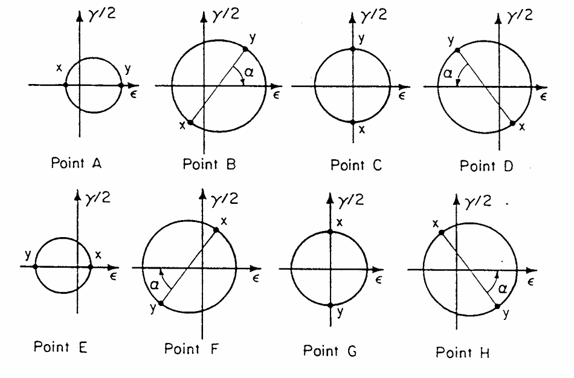
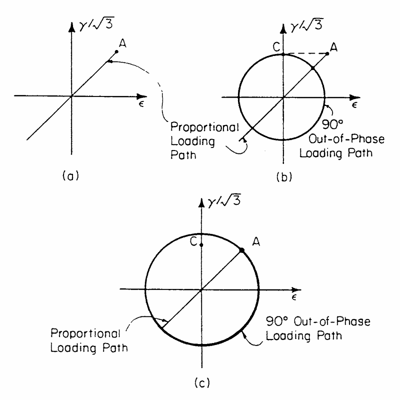

# Introduction

Stress states where the principal stresses change in direction or are nonproportional are called **complex stress states**. When these arise in notches or joint connections, their fatigue is called **multiaxial fatigue**. Most fatigue data is experimentally determined from uniaxial loading. The effects of multiaxial loading are known to a lesser extent and no consensus has been reached regarding the "best" multiaxial fatigue theory.

# Background

There are two key points to be noted in the development of multiaxial fatigue.

1.  The multiaxial stress and strain state at a point and how this state changes with time.

2.  The cracking behavior of a material under multiaxial fatigue loading.

## Stress State

The principal stresses in multiaxial fatigue are usually nonproportional, meaning their directions change and are functions of time. Mohr's circle is typically used to aid in understanding how the stress strain state changes over time.

{#fig-mohr-circle-uniaxial-loading .lightbox width="700"}

In Fig. @fig-mohr-circle-uniaxial-loading, a specimen experiences cyclic uniaxial loading. As Mohr's circle increases and decreases depending on the applied strain, point $Y$ remains on the $\varepsilon$ axis. That is, the principal stresses are proportional as their directions do not change over time.

::: {#fig-mohr-circle-multiaxial-loading .lightbox layout-nrow="2"}

{.lightbox width="700"}

{.lightbox width="700"}

Mohr's circle representation of combined axial and torsional strain loading
:::

However, Fig. @fig-mohr-circle-multiaxial-loading shows a combined axial and torsional loading case in one cycle. Since the ratio between the shear strain, $\gamma/\sqrt 3$, and axial strain, $\varepsilon$, vary across the cycle, the loading is nonproportional. The direction of the principal stresses and strains change across all eight points and point $Y$ is no longer on the $\varepsilon$ axis at all times.

::: callout-warning

Blindly applying concepts derived from uniaxial fatigue theory to multiaxial cases may result in significant errors. An example of this is comparing combined axial and torsional loading to bending and torsional loading.

Generally, a valid assumption for proportional loading is a negligible phase difference between normal and shear stresses and strains (i.e., as normal stress and strain change, shear stress and strain change instantaneously).

However, experimental data has shown that combined out-of-phase loading is more damaging than in-phase loading. A phase angle of $90^{\circ}$ gives the lowest fatigue life while in-phase produced the highest. Assuming a negligible phase difference from uniaxial fatigue in multiaxial fatigue will result in a non-conservative analysis.

:::

When comparing proportional and nonproportional tests, either the **maximum applied shear strain** or the **total cycle's maximum shear strain** may be kept constant. The former is the shear strain under the applied load and the latter is the shear strain attained under no normal strain conditions.

{#fig-applied-total-shear-strain-comparison .lightbox width="600"}

Fig. @fig-applied-total-shear-strain-comparison shows the same proportional loading path and two different nonproportional loading path, both with a phase angle of $90^{\circ}$. In Fig. [@fig-applied-total-shear-strain-comparison]b, the nonproportional load path has the same **applied** shear strain as the proportional one (point $C$). However, this is less than the total cycle's maximum shear strain in Fig. [@fig-applied-total-shear-strain-comparison]c.

## Cracking Observations

Cyclic loading results in fatigue crack nucleation primarily through to-and-fro slip. This mechanism occurs as a result of grain slippage along the slip plane. As the shear stress and strain is applied, the material's grains slip in-plane on the plane of maximum shear strain. This results in a weakened band of material called **slip bands**. When the cyclic load is reversed, the grains slip in the opposite direction and the cycle is repeated. This to-and-fro motion eventually pushes a thin layer of material out of the local surface (extrusion) or creates a tiny crevice (intrusion). These features act as microscopic stress concentrators that serve as hotspots for material separation.

Forsyth (1961) noted that fatigue crack growth could be divided into a Stage I and Stage II growth regime. Stage I includes nucleation and early growth, whereas Stage II includes propagation in the direction perpendicular to the maximum principal stress range.

Both normal and shear stresses and strains play an important role in Stage I growth. Normal stresses and strains inhibit and reduce the amount of Stage I growth.

# Multiaxial Theories

Early multiaxial fatigue theories were extensions of static yield theories applied to combined loading conditions. Sinces (1955) developed a multiaxial theory similar to the von Mises yield theory that served as a basis for other multiaxial theories in the 1960s. By the 1970s, critical plane multiaxial theories were developed based on the premise that failure occurred when damage along a critical plane exceeded a certain value.

## Equivalent Stress/Strain Approaches

Early multiaxial fatigue theories were extrapolations of static yield theories on combined loading. There are three main static yield theories listed, all given in terms of stress and strain.

1.  Maximum principal stress/strain

2.  Maximum shear stress/strain

3.  Octahedral (von Mises) criteria, based on distortion energy

These theories rely on a linear stress-strain relation, meaning they are limited to the **high cycle fatigue** (HCF) regime where the stresses are mostly elastic. For each theory, $\sigma_i$ and $\varepsilon_i$ denotes principal stress and strain, and are ordered so that $\sigma_1\geq\sigma_2\geq\sigma_3$ and $\varepsilon_1\geq\varepsilon_2\geq\varepsilon_3$. Additionally, define $\sigma_e$ and $\varepsilon_e$ as the effective stress and strain.

### Maximum Principal Stress/Strain

$$
\begin{aligned}
\sigma_e & =\sigma_1 \\
\varepsilon_e & =\varepsilon_1
\end{aligned}
$$ {#eq-max-principal-stress-yield-theory}

### Maximum Shear Stress/Strain

Also called the Tresca criteria

$$
\begin{aligned}
\tau_e & =\left|\frac {\sigma_1-\sigma_3}2\right| \\
\frac {\gamma_e}2=\frac {(1+\nu)\varepsilon_e}2 & =\left|\frac {\varepsilon_1-\varepsilon_3}2\right|
\end{aligned}
$$ {#eq-tresca-yield-theory}

### Octahedral Criteria

Also called the von Mises criteria, it is based off the distortion energy exceeding the amount needed for yielding.

$$
\begin{aligned}
\sigma_e & =\sqrt{\frac 12\left[(\sigma_1-\sigma_2)^2+(\sigma_2-\sigma_3)^2+(\sigma_3-\sigma_1)^2\right]} \\
\varepsilon_e & =\beta\sqrt{(\varepsilon_1-\varepsilon_2)^2+(\varepsilon_2-\varepsilon_3)^2+(\varepsilon_3-\varepsilon_1)^2}
\end{aligned}
$$ {#eq-von-mises-yield-theory-resolved}

where $\beta=\frac 1{(1+\nu)\sqrt2}$ and $\nu$ is the Poisson ratio. If the principal stresses and strains are unresolved, then Eqn. (@eq-von-mises-yield-theory-resolved) is also

$$
\begin{aligned}
\sigma_e & =\sqrt{\frac 12\left[(\sigma_x-\sigma_y)^2+(\sigma_y-\sigma_z)^2+(\sigma_z-\sigma_x)^2+6\left(\tau_{xy}^2+\tau_{yz}^2+\tau_{xz}^2\right)\right]} \\
\varepsilon_e & =\beta\sqrt{(\varepsilon_x-\varepsilon_y)^2+(\varepsilon_y-\varepsilon_z)^2+(\varepsilon_x-\varepsilon_z)^2+6\left[\left(\frac {\gamma_{xy}}2\right)^2+\left(\frac {\gamma_{yz}}2\right)^2+\left(\frac {\gamma_{xz}}2\right)^2\right]}
\end{aligned}
$$ {#eq-von-mises-yield-theory-unresolved}

::: {.callout-note title="Poisson's Ratio for Elastic-Plastic Materials" collapse="true"}

Poisson's ratio, $\nu$, varies as the load is applied and stress state changes. In fully elastic cases, $\nu=0.3$, whereas for fully plastic cases, $\nu=0.5$. For elastic-plastic cases across the full spectrum, an equivalent Poisson's ratio, $\nu^*$, is used.

$$
\nu^*=\frac {\nu_e\varepsilon_e+\nu_p\varepsilon_p}{\varepsilon_t}
$$ {#eq-poisson-ratio-elastic-plastic}

where $\nu_e$ and $\nu_p$ are the elastic and plastic Poisson's ratio, $\varepsilon_e$ and $\varepsilon_p$ are the elastic and plastic strain, and $\varepsilon_t$ is the total strain. Generally, $\nu_e=\frac 13$ and $\nu_p=\frac 13$.

:::

### Torsional Strain-Life Curve

Equations (@eq-max-principal-stress-yield-theory) through (@eq-von-mises-yield-theory-unresolved) can be used to develop a torsional strain-life curve in terms of uniaxial fatigue properties.

$$
\frac {\Delta\gamma}2=\frac {\tau_f'}G(2N_f)^b+\gamma_f'(2N_f)^c
$$ {#eq-torsional-strain-life-general}

#### Maximum Principal Stress/Strain

Using Eqn. (@eq-max-principal-stress-yield-theory) for stress, then $\sigma_e$ is

$$
\begin{aligned}
\mathrm{Tension}\qquad\qquad\sigma_e & =\sigma_1 \\
\mathrm{Torsion}\qquad\qquad\sigma_e & =\sigma_1=\tau
\end{aligned}
$$

And for strain

$$
\begin{aligned}
\mathrm{Tension}\qquad\qquad\varepsilon_e & =\varepsilon_1 \\
\mathrm{Torsion}\qquad\qquad\varepsilon_e & =\varepsilon_1=\dfrac {\gamma}2
\end{aligned}
$$

The torsional strain-life equation, Eqn. (@eq-torsional-strain-life-general) becomes

$$
\frac {\Delta\gamma}2=\frac {\sigma_f'}G(2N_f)^b+2\varepsilon_f'(2N_f)^c
$$ {#eq-torsional-strain-life-max-principal}

#### Maximum Shear Stress/Strain

The torsional strain-life equation is

$$
\frac {\Delta\gamma}2=\frac {\sigma_f'}{2G}(2N_f)^b+(1+\nu)\varepsilon_f'(2N_f)^c
$$ {#eq-torsional-strain-life-tresca}

::: {.callout-note title="Derivation of Torsional Strain-Life Equation for Tresca's Criterion" collapse="true"}

The stress state from the maximum shear stress or strain criteria is

$$
\begin{aligned}
\mathrm{Tension}\qquad\qquad\tau_e & =\dfrac {\sigma_1}2 \\
\mathrm{Torsion}\qquad\qquad\tau_e & =\tau
\end{aligned}
$$

Therefore, $\tau_f'=\frac {\sigma_f'}2$. For the torsional strain, use $\varepsilon_3=-\nu\varepsilon_1$ in tension to get

$$
\begin{aligned}
\mathrm{Tension}\qquad\qquad\dfrac {\gamma_e}2 & =\dfrac {\varepsilon_1-\varepsilon_3}2=\frac {(1+\nu)\varepsilon_1}2 \\
\mathrm{Torsion}\qquad\qquad\dfrac {\gamma_e}2 & =\dfrac {\varepsilon_1-\varepsilon_3}2=\dfrac {\gamma}2
\end{aligned}
$$

Putting everything together, $\tau_f'$ and $\gamma_f'$ are

$$
\begin{aligned}
\tau_f' & =\frac {\sigma_f'}2 \\
\gamma_f' & =(1+\nu)\varepsilon_f'
\end{aligned}
$$

:::

#### Octahedral Criteria

Using von Mises on Eqn. (@eq-torsional-strain-life-general)

$$
\frac {\Delta\gamma}2=\frac {\sigma_f'}{G\sqrt3}(2N_f)^b+\varepsilon_f'\sqrt3(2N_f)^c
$$ {#eq-torsional-strain-life-von-mises}

Equivalent stress/strain approaches are often used as first approximations in applications as they have a large amount of fatigue data available.

## Sines' Model and Similar Approaches

Sines investigated the influence of static mean stresses on the planes of maximum shear stresses. Through experimentation, he observed that

1. A torsional mean stress **did not** affect the fatigue life under alternating torsion or bending stresses.

2. A tensile mean stress **reduced** the fatigue life under alternating torsional loading.

3. A tensile mean stress **reduced** the fatigue life under cyclic axial loading (tension-compression loading) while a compressive mean stress **increased** the fatigue life.

From experimental data, Sines developed the model

$$
\begin{aligned}
\frac 13\sqrt{(P_1-P_3)^2+(P_2-P_3)^2+(P_1-P_3)^2}+\alpha(S_x+S_y+S_z)\leq A
\end{aligned}
$$ {#eq-sines-model}

where $P_1$, $P_2$, and $P_3$ are the amplitudes of the alternating principal stresses; $S_x$, $S_y$, and $S_z$ are the orthogonal mean stresses; $A$ is a constant proportional to the reversed fatigue strength; and $\alpha$ is a constant that gives the variation of the allowed stress range with the static stress. Any coordinate system can be used to report the orthogonal static mean stresses and parameters $A$ and $\alpha$ are material properties determined for a given life.

The first term in Eqn. (@eq-sines-model) is the octahedral shear stress, $\tau_{\mathrm{oct}}$, and it averages the effect of shear stress on many differently oriented slip planes if present. The second term in Eqn. (@eq-sines-model) accounts for hydrostatic stress.

For a given "class" of loading, $A$ and $\alpha$ can be determined from Eqn. (@eq-sines-model). For completely reversed uniaxial loading, $\sigma_{\mathrm{min}}=-\sigma_{\mathrm{max}}$ and $R=-1$. Since the loading is uniaxial, assume the amplitude of the reversed axial stress, $f_1$ is in the direction of $P_1$ so $P_2=P_3=0$. Additionally, since $\sigma_{\mathrm m}=0$, then $S_x=S_y=S_z=0$. Therefore
$$
A=\frac {P_1\sqrt2}3=\frac {f_1\sqrt2}3
$$

Now, if the loading is from zero to max, $R=0$ and $\sigma_{\mathrm{min}}=0$ now. This is still the same "loading class" as both $R=0$ and $R=-1$ apply for uniaxial loads. This time, assuming the $x$ axis is axial, then $S_x'=P_1'$ and $P_2'=P_3'=S_y'=S_z'=0$. Eqn. (@eq-sines-model) becomes

$$
\frac {P_1'\sqrt2}3=A-\alpha P_1'
$$

Solving for $\alpha$ and substituting $A=\frac {\sqrt2}3f_1$ gives

$$
\alpha=\frac A{P_1'}-\frac {\sqrt2}3=\frac {\sqrt2}3\left(\frac {f_1}{f_1'}-1\right)
$$

where $f_1'$ is the amplitude of the fluctuating stress that would cause final failure at the same life as $f_1$.