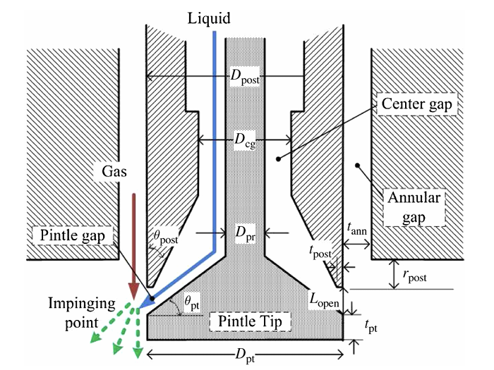

The design parameters for a throttling gas-liquid pintle injector are shown in @fig-parameters-schematic. Three different pintle tips were tested with different tip angles, $\theta_{\mathrm{pt}}$, in this paper. The post angle, $\theta_{\mathrm{post}}$, was fixed to be 30&#176.

{#fig-parameters-schematic width=500 .lightbox}

Since $\theta_{\mathrm{post}}$ is sufficiently small, the minimum orifice area for the liquid flow always occurred at the post tip. For larger values of $\theta_{\mathrm{post}}$ relative to $\theta_{\mathrm{pt}}$, the minimum cross-sectional area may occur further upstream. This is an important design factor to consider, as if the minimum orifice area in the pintle changes, so does the discharge coefficient.

::: {layout-nrow=2}
:::

The minimum orifice area, $A_{\mathrm{min}}$, can be calculated using

$$
A_{\mathrm{min}}=\frac {\pi}{\sin\theta_{\mathrm{pt}}}\left[\left(R_{\mathrm{post}}-t_{\mathrm{post}}\right)^2-\left(R_{\mathrm{post}}-t_{\mathrm{post}}-L_{\mathrm{open}}\sin\theta_{\mathrm{pt}}\cos\theta_{\mathrm{pt}}\right)^2\right]
$$ {#eq-min-area}

As the throttle increases and $L_{\mathrm{open}}$ increases, $A_{\mathrm{min}}$ increases as well. At some point during the throttle, however, the minimum orifice area will be equal to the center gap area, $A_{\mathrm{cg}}$, which is a constant set by the design of the pintle. After this transition point, the minimum orifice area is now $A_{\mathrm{cg}}$ and remains constant throughout the rest of the throttle.