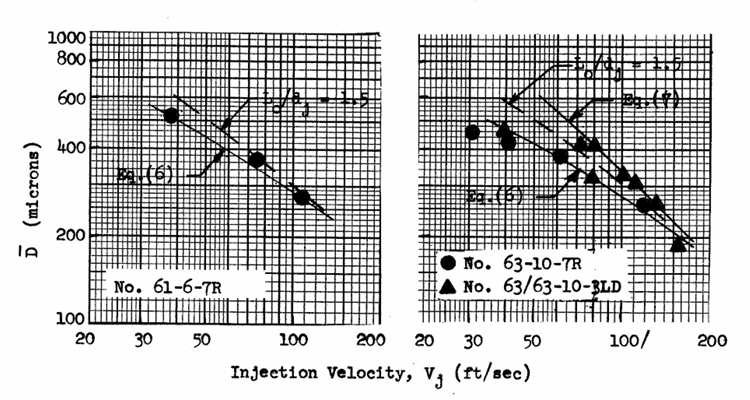
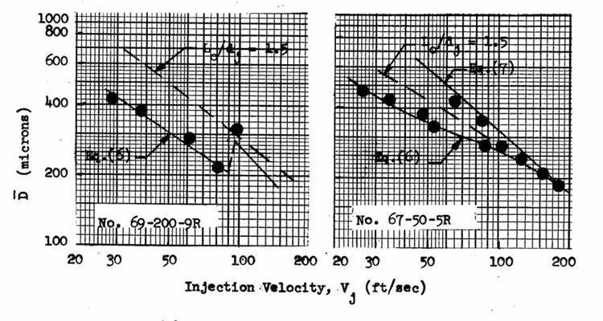

# Free Jet Characteristics

The internal characteristics of the jet, including the state of velocity profile development, Reynolds number and turbulence level, the manifold or orifice entrance conditions, etc., are important parameters that affect the degree of atomization happening. From theory, similar flow fields exist for geometrically similar objects with identical initial conditions and Reynolds numbers. For these experiments, the initial conditions are defined to be at the orifice entrance; and between experiments, these conditions remain identical or nearly identical as the flow is quiescent or nearly quiescent. Because of this, the jet's characteristics at the orifice exit are only a function of Reynolds number and orifice length.

However, practically speaking, cross-flows exist at the orifice entrance in many injection systems owing to the fact that the flow is not perfectly settled as it collects the feeder manifolds. As a result, the entrance conditions, such as manifold Reynolds number, orifice entrance geometry, orifice Reynolds number, and orifice length, will affect the velocity profile growth and transition from laminar to turbulent flow.

Furthermore, as the jet exist the orifice and collides with a neighboring stream, the change in characteristics and any onset of jet disintegration will also affect atomization. This is not an objective of the experiments, but some data on the influence of free jet length and jet characteristics are presented.

## Influence of Reynolds Number and Orifice Length

Changing the injection velocity and orifice diameter allowed for varying Reynolds number. For geometrically similar orifices of constant $L_o/d_j$, the velocity profiles were found to be identical, proving flow field dynamic similarity at equal Reynolds numbers. As a result, for any other fluid with geometrically similar orifices, the velocity profile is already known based off the available data.

## Influence of Orifice Entrance Conditions

Both hydraulic and geometric orifice inlet conditions play a significant role on the development of the free jet's internal characteristics. In the experiments, sharp and round geometric conditions were examined, whereas injection velocity and manifold cross-velocities were examined for the hydraulic conditions.

For rounded orifices, transition to turbulence occurred for inlet $\mathrm{Re}\leq2300$. Since the inlet flow is laminar, turbulent transition occurred within the orifice. One exception occurred for the like-doublet element No. 63/63-10-3LD, where the inlet $\mathrm{Re}\simeq2900$, so the inlet flow could have already been turbulent. The level of turbulence for this element No. was still on the same order as that obtained for a fully developed jet.

For sharp-edged orifices in quiescent entry conditions, the jets were completely separated from the orifice walls across the $L_o/d_j\leq10$ considered. The Reynolds number at separation ranged from $\mathrm{Re}=3300$ for $2L_o/d_j$ to $\mathrm{Re}=4500$ for $10L_o/d_j$ for both wax and dew fluids. These Reynolds numbers may be much lower or higher, however, for other fluids, as the point of separation depends on the fluid's vapor pressure as well: increasing the fluid's vapor pressure or Reynolds number decreases cavitation margin and also promotes wall separation.

## Influence of Free Jet Length

# Atomization Characteristics

For the experimental data, the parameters captured in the empirical correlations are

$$
\overline D=\overline D\left[\left(V_j, d_j, \gamma, \frac {p_c}{p_j},\frac {\psi_c}{p_j}, \frac {\Delta}{d_j}\right)_1, \left(P_{D_i}, \frac {d_{j_i}}{d_{j1}}, \frac {\psi_i}{p_{j1}},\frac {p_{c_i}}{p_{j1}}, \frac {\Delta_i}{d_{j1}}\right)_{i=2,\ldots n}\right]
$$ {#eq-correlation-parameters}

There are additional parameters not accounted for in @eq-correlation-parameters, most notably the flow conditions at the entrance of the injection orifice, the orifice length $L_0$, and the interaction between the impinging jet and the ambient surroundings across the jet free length $L_j$. @eq-correlation-parameters takes these factors into account through their effect on the velocity profile and turbulence.

## Like-Doublet Atomization Characteristics

For like-doublets, the parameters in @eq-correlation-parameters that relate one jet's characteristics with that of the other's is all one. The angle $\gamma$ is defined as the included angle between the jets and $\Delta$ is the distance between the jets at the impingement point. The simplified form of @eq-correlation-parameters becomes

$$
\overline D=CV_j^{\alpha_1}d_j^{\alpha_2}\left(\frac {p_c}{p_j}\right)^{\alpha_3}\left(\frac {\psi_c}{p_j}\right)^{\alpha_4}\gamma^{\alpha_5}\left(1-\frac {\Delta}{d_j}\right)^{\alpha_6}
$$ {#eq-like-doublet-correlation-general}

The factor $1-\frac {\Delta}{d_j}$ is used since it results in @eq-like-doublet-correlation-general being finite when $\Delta=0$. Using a least squares regression technique to determine $C$ and $\alpha_i$, @eq-like-doublet-correlation-general was curve fit to flow through a $0.081$ inch diameter orifice. For a laminar jet, the correlation is

$$
\overline D=4.85\times10^4V_j^{-0.75}d_j^{0.57}\left(\frac {p_c}{p_j}\right)^{-0.52}
$$ {#eq-like-doublet-laminar-jet-correlation}

For a turbulent jet, the empirical equation is

$$
\overline D=15.9\times10^4V_j^{-1.0}d_j^{0.57}\left(\frac {p_c}{p_j}\right)^{-0.10}
$$ {#eq-like-doublet-turbulent-jet-correlation}

This correlation was curve fit for all $\overline D$ values for $10\leq L_o/d_j\leq50$ and $L_o/d_j=1.5$. The exponent of $d_j$ was set equal to that of @eq-like-doublet-laminar-jet-correlation due to the small range of $d_j$ considered. When compared against experimental data, several points do not conform to either @eq-like-doublet-laminar-jet-correlation or @eq-like-doublet-turbulent-jet-correlation in the range $70\leq V_j\leq100$ ft/s. For these cases, the flow is likely transitional and experiences intermittent laminar and turbulent characteristics.

::: {#fig-like-doublet-dropsize-velocity layout-nrow=2}

{.lightbox}

{.lightbox}

Mass median dropsizes for like-doublet elements against varying injection velocities across a range of $L_o/d_j$
:::